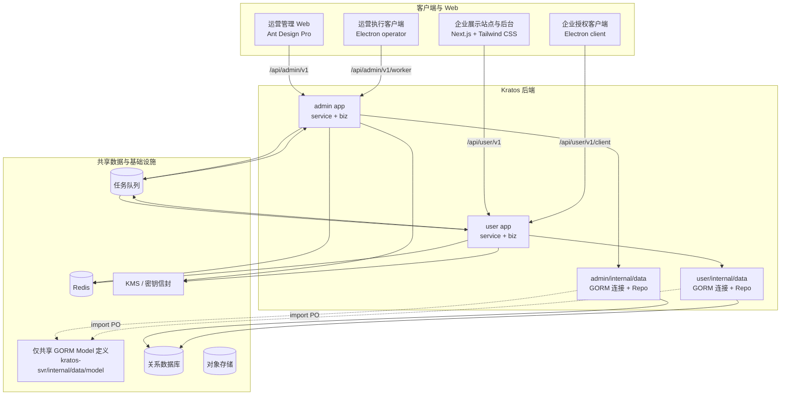

# GEO 系统技术架构与开发规范

> 文档状态：待技术评审
> 版本：v0.1
> 更新日期：2026-07-18
> 关联文档：[系统总体规划](GEO_SYSTEM_PLAN.md) · [后端功能规划](kratos-svr/GEO_BACKEND_FUNCTION_PLAN.md) · [桌面客户端规划](geoclient/docs/GEOCLIENT_FUNCTION_PLAN.md)

## 1. 文档目标

本文确定 GEO 系统的技术架构、代码目录、共享数据模型、表命名、后端分层、前端工程和交付规范，作为后续数据库设计、Proto 契约、页面开发和任务拆分的依据。

已经确认的技术选型：

| 范围 | 选型 | 说明 |
|---|---|---|
| 后端框架 | Go 1.25 + Kratos v3 | `admin` 与 `user` 两个 app，HTTP/gRPC 契约由 Proto 生成 |
| ORM | GORM | admin/user 各自在本 app 的 data 层建立连接、管理事务并直接操作数据库 |
| 共享数据模型 | `kratos-svr/internal/data/model/` | 企业侧业务表同时被 admin/user 使用，仅将共享 GORM PO 定义放在大仓根级目录 |
| 运营管理 Web | Ant Design Pro | 主要面向内部人员，优先开发效率、权限、表格和表单能力 |
| 企业用户 Web | Next.js + TypeScript + Tailwind CSS | 同时承担公开展示站点和企业后台，重点保证视觉效果、SEO、响应式和交互体验 |
| 桌面客户端 | 现有 Electron + Next.js | 继续负责平台授权、文章投放和 GEO 收录查询执行，不与 Web 前端混为一个构建 |
| API 契约 | Proto + OpenAPI | 后端生成 OpenAPI，Web/Electron 从契约生成 TypeScript 类型和客户端 |

尚未确定数据库引擎。GORM 是 ORM，不等于数据库选型；正式设计迁移脚本前必须确认使用 PostgreSQL 或 MySQL，以及版本、字符集、时区和高可用方式。

## 2. 总体架构



核心原则：

1. admin/user 共享数据库结构和 GORM Model 定义，但数据库连接、Repository 和事务各自在 app data 层实现。
2. 企业侧数据以 `enterprise_id` 隔离；admin 跨企业访问必须有平台权限和审计。
3. 根级 `internal/data` 只放 `model` 定义，不连接数据库、不执行查询、不提供事务或 Repository。
4. 两个 Web 前端共享 API 契约和基础工具，不强行共享 UI 组件体系。
5. 长耗时的文章生成、发布、GEO 查询、报告和导出采用任务化处理。

## 3. 建议仓库目录

```text
geohelper/
├── kratos-svr/
│   ├── api/
│   │   ├── admin/v1/                 # 平台运营 DTO / HTTP / gRPC 契约
│   │   ├── user/v1/                  # 企业用户 DTO / HTTP / gRPC 契约
│   │   └── common/v1/                # 少量稳定公共 DTO，不放业务实现
│   ├── app/
│   │   ├── admin/
│   │   │   ├── cmd/admin/
│   │   │   └── internal/
│   │   │       ├── service/          # 一实体域一文件，admin DTO ↔ DO
│   │   │       ├── biz/              # 一实体域一文件，用例和 Repo 接口
│   │   │       ├── data/             # GORM 连接、事务、同名 Repo、PO ↔ DO
│   │   │       └── server/
│   │   └── user/
│   │       ├── cmd/user/
│   │       └── internal/
│   │           ├── service/          # 一实体域一文件，user DTO ↔ DO
│   │           ├── biz/              # 一实体域一文件，用例和 Repo 接口
│   │           ├── data/             # GORM 连接、事务、同名 Repo、租户过滤
│   │           └── server/
│   ├── cmd/
│   │   └── migrate/                  # 独立迁移命令
│   ├── internal/
│   │   ├── data/
│   │   │   └── model/                # 仅共享 GORM PO；按实体域拆分文件
│   │   └── migrate/                   # 迁移命令内部实现，不放 data 目录
│   ├── migrations/                   # 版本化 SQL，不放 internal/data
│   └── configs/
├── web/
│   ├── pnpm-workspace.yaml
│   ├── apps/
│   │   ├── admin/                    # Ant Design Pro / Umi Max
│   │   └── user/                     # Next.js App Router + Tailwind CSS
│   └── packages/
│       ├── admin-api-client/         # admin OpenAPI 生成客户端
│       ├── user-api-client/          # user OpenAPI 生成客户端
│       ├── shared-types/             # 无框架依赖的少量公共类型
│       ├── eslint-config/
│       └── tsconfig/
└── geoclient/                        # 现有 Electron 双客户端，保持独立构建
```

`web` 可作为新的 pnpm workspace。暂不强制把 `geoclient` 迁入同一 workspace，避免影响现有 Electron 打包；API 契约可由统一生成脚本分别输出。

## 4. Kratos 后端分层

### 4.1 DTO、DO、PO 边界

| 模型 | 位置 | 用途 | 禁止事项 |
|---|---|---|---|
| DTO | `api/<domain>/v1/*.proto` | HTTP/gRPC 请求响应 | 不加 GORM tag，不直接作为数据库模型 |
| DO | `app/<app>/internal/biz` | 业务规则和用例输入输出 | 不依赖 GORM、SQL 或 Proto DTO |
| PO | `internal/data/model` | 仅定义 GORM 表映射和持久化关系 | 不连接数据库，不提供查询、事务、Repository 或业务规则 |

调用链：

```text
HTTP/gRPC -> service(DTO ↔ DO) -> biz(DO + Repo interface)
          -> app/*/internal/data(Repo implementation, DO ↔ PO)
          -> GORM database

app/*/internal/data -.import.-> internal/data/model(GORM PO definitions only)
```

根级 `internal/data/model` 只定义数据库形状，不是公共 data service。admin 和 user 的 GORM 初始化、仓储、查询、事务和 PO ↔ DO 转换全部留在各自 app 的 `internal/data`。

### 4.2 根级 internal/data 只保存 Model

目标目录只有 Model 定义：

```text
internal/data/
└── model/
    ├── base.go                  # BaseModel、TenantModel 等字段定义
    ├── table.go                 # 显式表名常量
    ├── admin_user.go            # 管理员账号 PO
    ├── admin_role.go            # 管理员角色与权限 PO
    ├── enterprise.go            # 企业主体 PO
    ├── enterprise_account.go    # 企业单账号 PO
    ├── article_type.go          # 文章类型及版本 PO
    ├── article.go               # 文章及版本 PO
    ├── publish_task.go          # 投放任务与尝试 PO
    ├── geo_task.go              # GEO 任务 PO
    ├── geo_answer.go            # GEO 回答、引用与提及 PO
    └── ...                      # 一个实体域一个文件，避免 models.go 大文件
```

该目录允许依赖 GORM 的字段类型和 tag，例如 `gorm.DeletedAt`，但禁止出现以下内容：

- `gorm.Open`、DSN、连接池和健康检查。
- Repository、查询方法、GORM Scope 或事务函数。
- Redis、队列、对象存储或 KMS Client。
- admin/user 的 DO、权限或业务状态流转。
- 迁移执行器或生产 AutoMigrate。

Model 文件按实体域拆分，而不是把所有表塞入一个 `models.go`。一个实体域可以包含该聚合内部紧密关联的主表、版本表和关联表，例如 `article_type.go` 可包含 ArticleType、ArticleTypeVersion 和 ArticleTypeChannelBinding。

### 4.3 app data 层直接连接和操作数据库

admin/user 分别在自己的 `internal/data/data.go` 初始化 GORM、配置连接池并在清理函数中关闭底层 `sql.DB`。每个 app 只创建一个连接池，通过 Wire 注入全部 Repository，不在每个 Repository 重复打开连接。

app 内的 `Data` 直接持有数据库和该 app 需要的基础设施：

```go
type Data struct {
	db    *gorm.DB
	cache Cache
}
```

典型文件：

```text
app/admin/internal/data/data.go          # admin GORM 初始化、连接池、清理
app/admin/internal/data/article_type.go  # ArticleTypeRepo，直接使用 d.db
app/admin/internal/data/enterprise.go    # admin 企业查询
app/user/internal/data/data.go           # user GORM 初始化、连接池、清理
app/user/internal/data/article.go        # ArticleRepo，强制 enterprise_id
app/user/internal/data/publish_task.go   # 企业投放任务 Repo
```

规则：

- repository 实现其对应 `biz` 包声明的接口。
- 构造函数返回 `biz.<Resource>Repo` 接口。
- repository 导入 `kratos-svr/internal/data/model` 并直接使用 `d.db.WithContext(ctx)` 查询。
- repository 显式选择字段，避免在复杂查询中滥用 `SELECT *`。
- user repository 的所有企业资源查询都必须应用 `enterprise_id`。
- admin repository 的跨企业查询必须由 biz 明确传入授权后的查询范围，不能默认“全库可见”。
- 驱动错误在 data 层映射为 biz 错误；不要把 GORM 错误泄漏到 service。
- 每个 repository 方法第一个参数是 `context.Context`，不把 context 存进结构体。
- admin/user 可以连接同一个数据库，但使用各自的配置、连接池、GORM Logger 和运行指标。

连接池参数必须配置化：最大打开连接、最大空闲连接、连接最大生命周期、空闲生命周期和慢查询阈值。

### 4.4 事务

需要事务的典型场景：

- 创建企业账号、订阅、初始配额和审计记录。
- 创建文章生成任务、预占额度和写 Outbox 事件。
- 创建发布/GEO 任务、尝试记录、额度预占和事件。
- 更新任务结果、结算用量和写证据索引。
- 撤销平台账号、销毁密钥信封和停止未执行任务。

事务由对应 app 的 data 层实现，例如 `app/admin/internal/data` 和 `app/user/internal/data` 各自提供仅供本 app Repository 使用的事务入口。事务中的 Repository 必须使用同一个 `tx.WithContext(ctx)`，禁止把事务函数放到根级 `internal/data/model`，也禁止嵌套创建互不关联的事务。

外部 API、对象存储和队列发送不放在数据库事务里。事务内写 Outbox，提交后由消费者可靠投递。

## 5. 共享 GORM 模型设计

### 5.1 为什么放在根级 internal/data

企业、品牌、文章、投放任务、GEO 结果等表既被 user app 写入，也被 admin app 查询和运营。若两个 app 各自定义一套 GORM struct，会产生：

- 列、索引和软删除规则漂移。
- 表名和关联名不一致。
- 同一迁移被两个服务重复维护。
- admin 查询企业数据时依赖 user app 的内部实现。

因此共享 PO 统一放在 `kratos-svr/internal/data/model`。Go 的 `internal` 规则允许 `kratos-svr` 仓库内的 app 导入，但仓库外无法导入。

### 5.2 表前缀规则

表前缀按业务域划分，不按“哪个 app 使用”划分。禁止为企业业务表使用 `admin_` 和 `user_` 两套前缀，因为 admin/user 会访问同一份企业数据。

| 前缀 | 领域 | 示例 |
|---|---|---|
| `adm_` | 平台内部管理员与 RBAC | `adm_users`、`adm_roles`、`adm_permissions`、`adm_role_bindings` |
| `agt_` | 代理商预留 | `agt_agents`、`agt_enterprise_histories` |
| `ent_` | 企业账号、套餐和用量 | `ent_enterprises`、`ent_accounts`、`ent_subscriptions`、`ent_usage_ledgers` |
| `cfg_` | 平台全局配置 | `cfg_article_types`、`cfg_prompt_templates`、`cfg_writing_models`、`cfg_publish_channels`、`cfg_inclusion_sites` |
| `kb_` | 企业知识库 | `kb_bases`、`kb_documents`、`kb_chunks` |
| `cnt_` | 品牌、关键词、问题、文章和素材 | `cnt_brands`、`cnt_keywords`、`cnt_questions`、`cnt_articles`、`cnt_article_versions` |
| `pub_` | 投放计划、任务和投稿结果 | `pub_plans`、`pub_tasks`、`pub_attempts`、`pub_submission_receipts` |
| `geo_` | GEO 监测、回答和分析 | `geo_monitor_plans`、`geo_tasks`、`geo_answer_snapshots`、`geo_citations`、`geo_mentions` |
| `wrk_` | 执行节点和租约 | `wrk_nodes`、`wrk_task_leases`、`wrk_heartbeats` |
| `sec_` | 平台授权和密钥安全 | `sec_platform_accounts`、`sec_credential_envelopes`、`sec_authorization_events` |
| `ops_` | 审计、通知、告警和可靠事件 | `ops_audit_logs`、`ops_notifications`、`ops_alerts`、`ops_outbox_events` |

同一领域内使用复数表名。表名一旦发布不可随意更名；业务重命名优先调整展示名，数据库改名必须走兼容迁移。

### 5.3 GORM TableName

由于系统存在多个前缀，不使用一个全局 `NamingStrategy.TablePrefix`。每个 PO 显式实现 `TableName()`，表名常量集中在 `model/table.go`：

```go
package model

const (
	TableEnterprises = "ent_enterprises"
	TableArticles    = "cnt_articles"
)

type Article struct {
	TenantModel
	Title   string `gorm:"column:title;type:varchar(255);not null"`
	Status  string `gorm:"column:status;type:varchar(32);not null"`
	Version uint64 `gorm:"column:version;not null;default:1"`
}

func (Article) TableName() string { return TableArticles }
```

不要依赖 struct 名自动推导关键业务表名，避免重构 Go 类型时意外改表。

### 5.4 基础字段

建议公共嵌入结构：

```go
type BaseModel struct {
	ID        uint64    `gorm:"column:id;primaryKey;autoIncrement"`
	CreatedAt time.Time `gorm:"column:created_at;not null"`
	UpdatedAt time.Time `gorm:"column:updated_at;not null"`
}

type SoftDeleteModel struct {
	BaseModel
	DeletedAt gorm.DeletedAt `gorm:"column:deleted_at;index"`
}

type TenantModel struct {
	SoftDeleteModel
	EnterpriseID uint64 `gorm:"column:enterprise_id;not null;index"`
}
```

使用规则：

- 配置、文章等可恢复资源使用软删除。
- 用量流水、审计、凭据事件、任务尝试、回答快照等不可变历史表不软删除。
- 时间统一保存 UTC，API 输出 RFC 3339。
- ID 统一 `BIGINT`；首期可自增，若未来跨库写入再统一迁移到分布式 ID，不允许各领域混用不同方案。
- 状态值使用稳定字符串或显式枚举映射，零值/空值表示未知，不使用含义不清的多个布尔字段拼状态。
- 金额使用 `DECIMAL` 或整数最小货币单位，积分和次数使用整数，禁止用浮点数表示金额。
- 大正文、截图和文件放对象存储；数据库保存正文文本、对象键、哈希和元数据，不保存大二进制。

### 5.5 多租户模型

所有企业资源必须直接包含 `enterprise_id`，不能只通过多层 JOIN 间接推导租户。理由是权限过滤、索引、审计和数据迁移都需要直接租户键。

示例索引：

```go
type Article struct {
	SoftDeleteModel
	EnterpriseID uint64 `gorm:"column:enterprise_id;not null;index:idx_cnt_articles_ent_status,priority:1"`
	Status       string `gorm:"column:status;type:varchar(32);not null;index:idx_cnt_articles_ent_status,priority:2"`
}
```

`(enterprise_id, status, created_at)` 等包含公共嵌入字段的复杂索引以版本化迁移 SQL 为最终定义，GORM tag 用于表达简单索引和模型意图。所有索引名称、列顺序和方言差异都必须在迁移评审中确认。

索引必须由实际访问模式决定，主要模式包括：

- 企业后台按 `enterprise_id + status + created_at` 查询文章、任务和账号。
- admin 按状态、企业、时间范围查询全局任务。
- worker 按 `status + scheduled_at + priority` 领取待执行任务。
- GEO 看板按 `enterprise_id + site_id + occurred_at` 聚合。
- 审计按 `actor_type + actor_id + created_at` 检索。

所有外键列建立索引。多对多关系使用关联表和组合唯一键，不把 ID 列表保存为逗号字符串。

### 5.6 关联与删除策略

| 关系 | 建议策略 |
|---|---|
| 企业 -> 企业业务资源 | 默认 `RESTRICT` 或业务归档，禁止误级联清空企业数据 |
| 文章 -> 文章版本 | 归档文章，版本保留；合规擦除走独立审计流程 |
| 任务 -> 执行尝试 | `RESTRICT`，历史不可删除 |
| 文章类型 -> 类型版本 | `RESTRICT`，已被生成任务引用的版本不可删除 |
| 凭据账号 -> 凭据信封 | 业务撤销后销毁密钥材料，保留脱敏安全事件 |
| 临时上传 -> 未绑定对象 | 定时清理，不通过业务表级联删除 |

数据库外键、唯一约束和 Check 约束应优先保证完整性。若最终数据库或部署规范明确禁止外键，必须以迁移约束检查、应用校验和定期一致性任务替代，并在技术评审中记录原因。

### 5.7 JSON 字段

JSON 只用于结构可变且不参与核心关联的数据，例如模型参数、平台能力、证据元数据。以下信息必须正规化：企业归属、文章与关键词关系、任务目标、引用链接、账号关系和权限绑定。

使用 `gorm.io/datatypes.JSON` 或带校验的自定义类型；biz 层转换为明确 DO。JSON Schema 需要带版本，避免历史数据无法解释。

## 6. 数据库迁移策略

### 6.1 生产环境不依赖 AutoMigrate

GORM `AutoMigrate` 仅允许本地开发和临时测试数据库使用。生产环境使用版本化迁移，原因是：

- 可审查具体 SQL、索引和锁表风险。
- 支持 UP/DOWN 或明确的前滚恢复方案。
- 可以执行数据回填和兼容发布。
- 避免 admin/user 两个进程同时自动迁移。

迁移不放在 `internal/data`。建议目录：

```text
migrations/
├── 000001_create_admin_and_enterprise.up.sql
├── 000001_create_admin_and_enterprise.down.sql
├── 000002_create_content.up.sql
├── 000002_create_content.down.sql
└── ...
```

由独立 `cmd/migrate` 调用 `internal/migrate` 在发布前运行。该命令为迁移目的单独连接数据库；admin/user 服务只校验数据库 schema version，不自动变更结构。

### 6.2 零停机变更

遵循“扩展 -> 双写/回填 -> 切读 -> 收缩”：

1. 先增加可空列或新表。
2. 发布兼容新旧结构的代码。
3. 分批回填并校验。
4. 切换读取和索引。
5. 下一个发布周期再删除旧列或旧表。

禁止一次发布中直接重命名正在使用的列、给大表增加无默认值的非空列或长时间锁表建索引。

### 6.3 数据模型变更流程

1. 修改 `internal/data/model` PO。
2. 编写版本化迁移和回滚/前滚说明。
3. 更新 app repository 的 PO ↔ DO 转换。
4. 必要时更新 Proto DTO 和 OpenAPI。
5. 执行迁移测试、repository 集成测试和 `make all`。
6. 在预发布环境使用接近生产规模的数据验证执行计划。

## 7. API 与服务边界

### 7.1 路由

```text
/api/admin/v1/...          Ant Design Pro 运营管理接口
/api/admin/v1/worker/...   Electron operator 执行接口
/api/user/v1/...           Next.js 企业站点和后台接口
/api/user/v1/client/...    Electron client 授权接口
```

四类身份使用不同 Token audience。即使 worker 路由部署在 admin app，也不能复用管理员 Token。

### 7.2 一个实体域一个 Proto 和 Service

每个独立实体域使用一个 Proto 文件，并在该文件定义对应的 Service、资源 DTO、请求和响应。不要按“admin 全部接口”或“user 全部接口”汇总成一个大文件。

建议拆分：

```text
api/admin/v1/admin_auth.proto
api/admin/v1/enterprise.proto
api/admin/v1/article_type.proto
api/admin/v1/publish_channel.proto
api/admin/v1/writing_model.proto
api/admin/v1/inclusion_site.proto
api/admin/v1/worker_task.proto
api/user/v1/auth.proto
api/user/v1/article.proto
api/user/v1/publish_task.proto
api/user/v1/geo_monitor.proto
api/user/v1/platform_account.proto
```

文件与代码按同一实体域同名对应：

```text
api/admin/v1/article_type.proto
app/admin/internal/service/article_type.go
app/admin/internal/biz/article_type.go
app/admin/internal/data/article_type.go
internal/data/model/article_type.go
```

`article_type.proto` 中定义 `ArticleTypeService`；`writing_model.proto` 中定义 `WritingModelService`。不要把 ArticleType、WritingModel、PublishChannel 等不相同的实体域塞进一个 `ConfigService`。

拆分规则：

- 一个实体域一个 `.proto`，通常对应一个 `<Entity>Service`。
- service、biz、data、model 使用相同实体域文件名，方便全链路查找。
- 聚合内部不可独立操作的子对象可以留在同一个 Proto，例如 ArticleTypeVersion 随 ArticleType 聚合管理。
- 真正独立生命周期、独立权限和独立列表入口的对象应拆成独立实体域。
- RPC 采用资源语义：Create、Get、List、Update、Delete，以及少量明确动作 RPC。
- 每个 Service 在对应 app 的 server 中单独注册，Wire 构造函数加入相应 ProviderSet。
- 共享分页或基础错误可以放 `api/common/v1`，企业、文章、账号等业务 DTO 不跨 admin/user 强行复用。
- `*.pb.go`、`*_http.pb.go`、`*_grpc.pb.go` 和 OpenAPI 由 `make all` 生成，禁止手改。

禁止创建一个包含所有 RPC 的 `service.proto`、`admin.proto` 或 `user.proto`。文件拆分以实体域为单位，不以页面数量或数据库表数量机械拆分。

### 7.3 列表、批量和导出

- 普通列表统一分页、过滤和排序，限制最大 `page_size`。
- 批量操作返回逐项成功/失败，不因单个失败丢失全部结果。
- 大型报表和导出创建异步任务，完成后返回有时效的下载地址。
- admin 的跨企业导出必须记录筛选条件、操作者、文件哈希和下载记录。

### 7.4 幂等和并发

- 创建生成、发布、GEO、导出任务接受 `client_request_id`。
- 任务领取使用 lease token、版本和过期时间，不只依赖状态字段。
- 更新文章、模板和系统配置使用版本号或更新时间进行乐观锁检查。
- 外部结果上报以任务、尝试和幂等键建立唯一约束。

## 8. 认证、权限与租户隔离

### 8.1 平台运营侧

- 管理员使用 RBAC：角色、权限点、菜单和数据范围。
- 代理商身份仅预留表和企业归属，当前不提供登录、页面或 API。
- 模拟企业登录、密钥测试、导出、删除、配额调整等敏感操作必须二次确认和审计。

### 8.2 企业侧

- 一个企业一个全功能账号，不建设企业成员和角色表。
- `enterprise_id` 从已验证 Token 写入 context，忽略客户端请求体中伪造的企业 ID。
- user repository 使用强制租户 Scope；按资源 ID 查询时仍同时带 `enterprise_id`。
- 企业冻结、过期或配额不足由 biz 层统一判断。

### 8.3 Web 会话

- Access/Refresh Token 优先保存在 `HttpOnly + Secure + SameSite` Cookie，不进入 localStorage。
- 通过同域反向代理或 Next.js BFF 减少跨域 Cookie 复杂度。
- Cookie 认证的写请求需要 CSRF 防护；登录、刷新、退出有独立限流。
- 管理端和企业端使用不同 Cookie 名、Domain/Path 和 audience，防止会话串用。

## 9. 运营管理 Web：Ant Design Pro

### 9.1 定位

运营端主要服务内部人员，目标顺序是：功能完整、信息密度、操作效率、权限正确、可审计，再考虑品牌化视觉。

建议技术栈：

- 项目初始化时选定并锁定的 Ant Design Pro 稳定版本。
- Umi Max + React + TypeScript。
- Ant Design、ProComponents、ProTable、ProForm、ProDescriptions。
- OpenAPI 生成的 admin API 客户端。
- 内置 Access 权限、菜单和布局能力。

### 9.2 工程结构

```text
web/apps/admin/src/
├── app.tsx                       # 运行时配置、初始状态、权限
├── access.ts                     # 权限点映射
├── layouts/                      # 全局布局和异常页
├── pages/
│   ├── dashboard/
│   ├── enterprises/
│   ├── article-types/
│   ├── writing-models/
│   ├── publish-channels/
│   ├── inclusion-sites/
│   ├── articles/
│   ├── publish-tasks/
│   ├── geo-tasks/
│   ├── workers/
│   ├── audits/
│   └── system/
├── services/                     # 生成客户端的薄封装
├── components/                   # 仅 admin 复用组件
└── constants/
```

### 9.3 页面规范

- 列表页优先 ProTable，查询条件与 URL 同步，支持刷新后恢复。
- 新增/编辑优先 DrawerForm 或 ModalForm；复杂配置使用独立页面。
- 文章类型、提示词和模型配置需要草稿、预览、试运行、发布、版本差异和回滚。
- 危险操作使用二次确认，要求填写原因；后端仍做权限和状态校验。
- 列表使用服务端分页、过滤和排序，不一次拉取全量数据。
- 权限控制同时覆盖菜单、页面、按钮和 API；前端隐藏不是安全边界。
- 错误提示展示可理解的信息和 request ID，不直接显示 SQL 或内部堆栈。

### 9.4 状态管理

- 登录用户、权限和全局配置放应用初始状态。
- 服务端数据由请求缓存库或 Umi request 管理，不复制到全局状态。
- 表单草稿只在确有恢复需求时本地保存，并带 schema version。
- Access Token 不进入 Redux、localStorage 或可持久化状态。

## 10. 企业用户站点：Next.js + Tailwind CSS

### 10.1 定位

同一个 Next.js 应用包含两部分：

1. 公开展示站点：产品介绍、解决方案、功能、案例、价格、帮助和下载，重视 SEO 与视觉效果。
2. 企业后台：企业资料、品牌、知识库、关键词、文章、投放任务、GEO 看板、授权状态、套餐和设置。

建议使用 Next.js App Router、React、TypeScript、Tailwind CSS。公共页面和企业后台共享品牌设计 Token，但使用不同 Layout。

### 10.2 路由结构

```text
web/apps/user/app/
├── (site)/                       # 公开页面，SSR/SSG/ISR
│   ├── page.tsx
│   ├── features/page.tsx
│   ├── solutions/[slug]/page.tsx
│   ├── cases/[slug]/page.tsx
│   ├── pricing/page.tsx
│   ├── help/[slug]/page.tsx
│   └── download/page.tsx
├── (auth)/
│   ├── login/page.tsx
│   └── forgot-password/page.tsx
├── (console)/console/            # 登录后的企业后台
│   ├── dashboard/page.tsx
│   ├── brand/page.tsx
│   ├── knowledge/page.tsx
│   ├── keywords/page.tsx
│   ├── articles/page.tsx
│   ├── articles/new/page.tsx
│   ├── publishing/page.tsx
│   ├── geo/page.tsx
│   ├── authorizations/page.tsx
│   ├── subscription/page.tsx
│   └── settings/page.tsx
├── api/                          # 必要的 BFF/会话 Route Handlers
├── sitemap.ts
├── robots.ts
└── layout.tsx
```

### 10.3 Server Component 与 Client Component

- 页面和数据展示默认使用 Server Component。
- 表单、富文本编辑器、图表交互、拖拽和浏览器 API 才使用 Client Component。
- `"use client"` 放在尽可能小的叶子组件，避免整个页面变成客户端渲染。
- 传给 Client Component 的数据最小化，避免序列化完整文章正文或无关权限数据。

### 10.4 数据获取

- 独立请求并行发起，使用 `Promise.all` 或拆分的 Suspense 边界避免瀑布。
- 公共内容使用 SSG/ISR；更新频繁内容使用按标签失效。
- 企业后台数据是用户私有数据，使用动态渲染和 `no-store`，不能进入共享公共缓存。
- 同一请求内重复读取可以用 `React.cache` 去重；跨请求缓存必须包含企业范围。
- 客户端需要轮询或交互刷新时使用 SWR 等具备去重能力的方案。
- 大型图表、富文本编辑器和仅特定页面使用的组件通过动态导入拆包。

### 10.5 Tailwind CSS 与设计系统

在 `tailwind.css` 或 CSS 变量中定义品牌 Token：

- 主色、辅助色、成功/警告/错误色。
- 背景、表面、边框和文字层级。
- 圆角、阴影、间距、字号和容器宽度。
- 明暗主题（如首期不做暗色，也预留变量而非散落硬编码颜色）。

页面组件按职责拆分：

```text
components/
├── marketing/                    # Hero、LogoWall、Feature、CTA、案例
├── console/                      # 企业后台业务组件
├── forms/
├── charts/
└── ui/                           # Button、Input、Dialog、Card 等基础组件
```

公共站点强调品牌视觉、响应式、动效克制和可访问性；企业后台强调清晰、可扫描和任务状态反馈。不要直接把 Ant Design Pro 组件混入用户站点。

### 10.6 SEO 与展示性能

- 每个公开页面提供 Metadata、canonical、Open Graph 和结构化数据。
- 自动生成 `sitemap.xml` 和 `robots.txt`。
- 图片使用 Next.js Image 或等效优化，指定尺寸避免布局跳动。
- 字体使用 `next/font`，减少外部字体阻塞。
- 首屏只加载必要 JS；统计、客服和非关键第三方脚本延后加载。
- 长列表使用分页或虚拟化，复杂图表按需加载。
- 以 Core Web Vitals、Lighthouse 和真实用户指标验证性能。

### 10.7 企业文章生成页面

创建文章的建议流程：

1. 选择品牌、关键词和目标问题。
2. 选择平台启用的文章类型，展示结构、适用渠道和所需输入。
3. 选择目标投放渠道，加载该类型的渠道变体规则。
4. 选择企业可用的千问、DeepSeek、Kimi 等文章编写模型。
5. 根据文章类型动态 Schema 渲染补充表单。
6. 提交异步生成任务，展示排队、生成、校验、完成或失败状态。
7. 预览并编辑结果，显示使用的类型、模板版本、模型、知识来源和用量。

企业端只收到文章类型展示信息和动态输入 Schema，不返回完整系统提示词或模型密钥。

## 11. Web 共享契约与代码

### 11.1 OpenAPI 生成

建议生成两个独立包：

```text
web/packages/admin-api-client/src/generated/
web/packages/user-api-client/src/generated/
```

生成流程：

1. 修改 Proto。
2. 在 `kratos-svr` 执行 `make api` 或 `make all`。
3. 输出 admin/user OpenAPI。
4. 在 `web` 执行 `pnpm api:generate`。
5. CI 检查生成文件无漂移。

生成文件不手改。业务层只在生成客户端外增加薄封装，用于错误转换、分页映射和业务语义，不重新手写路径。

### 11.2 不共享 UI 体系

Ant Design Pro 与 Tailwind 用户站点的设计目标不同。共享范围限定为：

- OpenAPI 类型和客户端。
- 与框架无关的状态常量和格式化函数。
- ESLint、TypeScript、测试配置。

不共享按钮、表格、表单等 UI 组件，避免 Ant Design 样式进入用户站点或 Tailwind 约束运营端效率。

## 12. Electron 协作边界

- `geoclient` 继续独立打包 client/operator 两个应用。
- Electron 使用生成的 worker/client OpenAPI 契约，不直连数据库。
- 文章编写模型和系统提示词只在服务端使用，不下发到 Electron。
- operator 领取任务时只获得不可变文章快照、文章类型/模板版本标识、投放目标和短时凭据。
- client 只处理需要企业网页登录态的投放渠道和 GEO 检查站点授权。
- Web 与 Electron 的登录 Token audience、Cookie/本地安全存储和权限完全隔离。

## 13. 缓存、队列、对象存储与搜索

### 13.1 Redis

适合：

- 登录会话、Token 黑名单和验证码。
- 短时幂等结果和限流计数。
- 任务调度辅助锁、节点在线状态和心跳摘要。
- 热点平台配置缓存。

Redis 不是任务、租约、配额和审计的唯一事实来源，关键状态必须落关系数据库。

### 13.2 任务队列

任务类型：文章生成、问题蒸馏、发布调度、GEO 分析、通知、报告、导出和 Outbox 投递。

消费者必须支持：幂等、有限重试、指数退避、死信、超时、取消和可观测性。浏览器发布/GEO 查询由 Electron worker 通过租约执行，队列负责调度信号，不直接替代租约表。

### 13.3 对象存储

保存知识库原文件、文章图片、发布截图、GEO 证据、报告和导出文件。对象键包含环境、企业和资源类型，但不包含密码、Cookie 等秘密。

上传使用短时签名 URL；下载校验企业归属和权限，不能仅凭可猜测的对象地址访问。

### 13.4 搜索

首期可用数据库索引和全文能力满足文章/关键词检索。只有在数据量、相关性或聚合需求明确超过数据库能力后再引入 Elasticsearch/OpenSearch，避免提前增加运维复杂度。

## 14. 安全规范

- 平台密钥、模型 API Key 和平台凭据使用 KMS/信封加密。
- GORM 日志默认参数化并脱敏，禁止打印 Cookie、Token、正文敏感数据和 API Key。
- admin/user 数据库账号按最小权限分离；迁移命令使用单独高权限账号。
- 所有输入在 service 层做结构校验，biz 层做业务校验，数据库做约束兜底。
- 富文本内容保存前清洗；展示时执行 XSS 防护和安全链接策略。
- 上传校验类型、大小、扩展名、内容签名和恶意文件。
- 所有敏感操作写 `ops_audit_logs`，审计日志不可由普通业务删除。
- 对登录、生成、导出、任务创建和结果上报做限流。
- 公开站点配置 CSP、HSTS、Referrer-Policy、Permissions-Policy 等安全头。

## 15. 可观测性

### 15.1 后端

- Kratos 中间件统一注入 request ID、trace ID、actor 和 enterprise ID。
- OpenTelemetry 串联 HTTP/gRPC、GORM、Redis、队列和外部模型调用。
- 指标覆盖请求延迟、错误 reason、连接池、慢 SQL、队列积压、任务耗时、模型成本和平台成功率。
- 错误只在最终处理边界记录一次；下层返回带上下文的错误，避免重复日志。

### 15.2 Web

- 记录页面性能、JS 错误、API request ID 和关键业务漏斗。
- 公开站点监控 Core Web Vitals。
- 不在前端监控中上传正文、提示词、Token、Cookie 或企业敏感数据。

### 15.3 告警

- admin/user API 错误率或 P95 超阈值。
- 数据库连接池耗尽、慢查询或复制延迟。
- 队列积压、租约大量过期、worker 离线。
- 单个平台/站点成功率突降。
- 模型调用成本、超时或失败率异常。
- 授权过期和 KMS 解封失败。

## 16. 测试策略

### 16.1 Go

| 层 | 测试重点 |
|---|---|
| service | DTO/DO 转换、字段校验、错误映射 |
| biz | 状态机、权限、配额、任务幂等和事务规则，使用 fake repo |
| data | GORM 查询、租户过滤、索引访问模式、错误映射和事务，使用真实测试数据库 |
| migration | 全新安装、逐版本升级、回滚/前滚和数据回填 |
| integration | admin/user 对同一 PO 的兼容性、Outbox、缓存和对象存储边界 |

使用表驱动测试。并发任务、租约和超时使用可控时间与真实唯一约束验证，不能只测顺序执行。

### 16.2 Admin Web

- 权限菜单和按钮。
- ProTable 查询、分页、排序和批量操作。
- 文章类型/提示词/模型配置的版本流程。
- 危险操作确认和错误状态。
- 构建、类型检查、Lint、组件测试和关键流程 E2E。

### 16.3 User Web

- 公共页面响应式、SEO metadata 和可访问性。
- 登录、企业隔离、文章生成、任务、GEO 看板和授权状态。
- Server/Client Component 边界和私有数据缓存策略。
- 类型检查、Lint、单元测试、组件测试、Playwright E2E 和 Lighthouse 基线。

### 16.4 Electron

继续执行现有 `pnpm check`，并增加正式 OpenAPI 契约检查、授权流程和 operator 任务端到端测试。

## 17. CI/CD 与发布

建议流水线：

1. Proto lint、breaking change 检查和生成文件一致性。
2. `make all`、`go test ./...`、静态检查和构建 admin/user/worker/migrate。
3. 在临时数据库执行全部迁移和 repository 集成测试。
4. 生成 OpenAPI 和 TypeScript 客户端，检查无漂移。
5. Admin Web 类型检查、Lint、测试和生产构建。
6. User Web 类型检查、Lint、测试、生产构建和 Lighthouse 基线。
7. GeoClient `pnpm check` 及对应平台安装包流水线。
8. 构建带版本和 Git SHA 的镜像/静态产物，生成 SBOM。
9. 先迁移数据库，再灰度后端，再发布 Web；破坏性收缩放到后续版本。

生产部署建议：

```text
admin.example.com           -> Ant Design Pro 静态资源
admin.example.com/api/...   -> Kratos admin
www.example.com             -> Next.js user 公共站点
app.example.com             -> Next.js user 企业后台（也可与 www 同应用）
app.example.com/api/...     -> Kratos user 或 Next.js BFF
```

若公开站点与企业后台使用同一域名，必须确保公共缓存不会缓存带企业 Cookie 的私有响应。

## 18. 开发顺序

### 阶段 1：基础工程

1. 确认数据库引擎和版本。
2. 建立根级 `internal/data/model`，只添加按实体域拆分的共享 GORM PO。
3. 在 admin/user 各自 `internal/data` 建立 GORM 连接、连接池、事务和 Repository 基础结构。
4. 建立表前缀常量、BaseModel、TenantModel、根级 `migrations` 和独立迁移命令。
5. 建立 admin/user Proto 命名空间、认证中间件和错误规范，并落实一实体域一 Proto/Service。
6. 初始化 `web/apps/admin`、`web/apps/user` 和生成 API 包。

### 阶段 2：身份与配置

1. 平台管理员 RBAC、企业单账号、套餐和审计。
2. 代理商表及可空归属字段，仅预留，不开放业务。
3. 文章类型、提示词、编写模型、投放渠道和 GEO 检查站点配置。
4. Admin Ant Design Pro 对应管理页面。

### 阶段 3：企业内容闭环

1. 品牌、知识库、关键词和问题。
2. 企业 Next.js 后台和文章生成流程。
3. 文章审核、版本、快照、任务和用量。
4. 企业授权客户端的正式 user/client API。

### 阶段 4：执行与分析

1. 发布任务、租约、worker API 和投稿回执。
2. GEO 任务、回答证据、分析结果和看板。
3. Operator Electron 正式接入。
4. 报表、通知、告警和运营复核。

## 19. 技术评审待确认项

- [ ] TECH-01 关系数据库选择 PostgreSQL 还是 MySQL，以及具体版本。
- [ ] TECH-02 主键首期使用数据库自增 BIGINT，还是从第一版使用分布式 ID。
- [ ] TECH-03 数据库是否允许外键；若不允许，完整性替代方案和巡检频率是什么。
- [ ] TECH-04 迁移工具选择及生产迁移审批流程。
- [ ] TECH-05 Redis、任务队列和对象存储的具体产品。
- [ ] TECH-06 admin/user 是否独立数据库账号，以及权限矩阵。
- [ ] TECH-07 Next.js 采用 Node.js Server 部署还是可支持的容器/平台部署。
- [ ] TECH-08 公共站点和企业后台使用同域、子域还是两个独立域名。
- [ ] TECH-09 Web 会话采用后端同域 Cookie，还是 Next.js BFF 统一管理。
- [ ] TECH-10 Ant Design Pro 采用的脚手架版本和 Umi Max 版本。
- [ ] TECH-11 OpenAPI TypeScript 客户端生成器和请求层标准。
- [ ] TECH-12 搜索首期是否只使用数据库能力。
- [ ] TECH-13 文章正文使用 Markdown、结构化 JSON、HTML，或同时保存编辑格式与渲染快照。
- [ ] TECH-14 富文本编辑器、图表库和公开站点基础 UI 组件方案。

## 20. 第一阶段技术验收标准

- [ ] ARCH-AC-01 admin/user 可以引用同一 `internal/data/model` PO，不存在重复 GORM 表定义。
- [ ] ARCH-AC-01A 根级 `internal/data` 除 Model 定义外，不包含数据库连接、Repository、事务、查询 Scope 或迁移执行逻辑。
- [ ] ARCH-AC-02 表名全部使用已登记的领域前缀，不依赖 GORM 自动猜测关键表名。
- [ ] ARCH-AC-03 user 的企业资源查询均带 `enterprise_id`，并有跨企业越权测试。
- [ ] ARCH-AC-04 admin 跨企业访问经过权限和审计，不因共享 PO 绕过 biz 层。
- [ ] ARCH-AC-05 生产服务不执行 AutoMigrate，迁移由独立命令完成。
- [ ] ARCH-AC-06 Proto、OpenAPI 和两个 Web API 客户端可一次命令生成且 CI 无漂移。
- [ ] ARCH-AC-06A 每个独立实体域都有同名 Proto、Service、biz、data 文件，可从接口快速定位到模型与仓储实现。
- [ ] ARCH-AC-07 Ant Design Pro 完成登录、权限、基础列表/表单和文章类型配置闭环。
- [ ] ARCH-AC-08 Next.js 完成公开首页、登录、企业后台布局和文章生成基础流程。
- [ ] ARCH-AC-09 私有企业响应不可被公共缓存，Token 不进入 localStorage。
- [ ] ARCH-AC-10 后端、Web 和 Electron 的 request ID/trace ID 可以关联一次完整任务。

## 21. 当前仓库基线

- `kratos-svr/go.mod` 已使用 Go 1.25.7 和 Kratos v3，但尚未加入 GORM 及数据库驱动依赖。
- `kratos-svr/internal/data`、`app/admin/internal/data`、`app/user/internal/data` 当前仍是 Todo 内存仓储模板，本文描述的是目标重构结构。
- 实施时应删除根级 `internal/data` 中的 Todo Repository/Data 模板，只保留新的 `model` 子包；admin/user 的数据库连接与操作分别在各自 app data 层实现。
- 当前还没有根级 `migrations` 和独立迁移命令，实施时与首批 Model 一起建立。
- `web/apps/admin` 与 `web/apps/user` 尚未创建；现有 `geoclient` 是 Electron 工程，不能直接视为新的企业 Web 站点。
- `geoclient/openapi.json` 是历史契约，后续必须切换到新 Kratos Proto 生成的 admin/user/worker/client OpenAPI。
