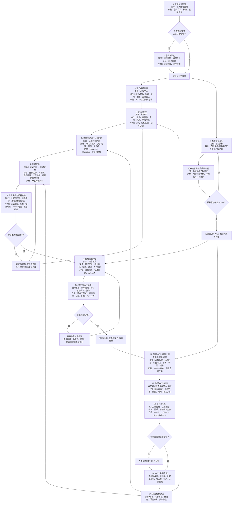
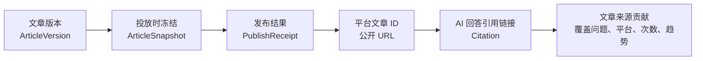

# 企业用户从登录到 GEO 效果监测的完整操作流程

> 本文基于当前企业用户侧功能、[GEO 系统总体规划](GEO_SYSTEM_PLAN.md)和
> [GEO 系统技术架构](GEO_TECHNICAL_ARCHITECTURE.md)，说明企业用户如何从账号登录开始，完成品牌资料建设、文章生产与投放，并最终进入 GEO 效果监测和持续优化闭环。

## 1. 流程目标

企业用户的完整操作流由两条准备链汇合：

1. **内容资产链**：品牌 → 知识库 → 关键词与问题 → 文章。
2. **执行能力链**：平台授权 → 投放账号和 GEO 检查站点可用。

两条链准备完成后，进入“文章生成 → 审核 → 投放 → GEO 监测 → 优化”的持续循环。

## 2. 完整业务流程图



## 3. 分步骤操作说明

| 步骤 | 页面或入口 | 用户操作 | 系统执行 | 产生内容 | 完成标准 |
|---|---|---|---|---|---|
| 1. 登录 | `/login` | 输入企业账号和密码 | 校验身份、企业状态、套餐和权限 | 登录会话、企业上下文 | 成功进入企业工作台 |
| 2. 企业初始化 | `/console/settings`、`/console/subscription` | 修改初始密码，填写企业资料，确认套餐和额度 | 保存企业资料及安全配置 | 企业档案、联系人、安全设置 | 企业资料完整且账号可正常使用 |
| 3. 品牌中心 | `/console/brand` | 新建品牌，填写行业、官网、地区和核心表达 | 建立企业范围内的品牌对象 | 品牌档案、品牌语义基线 | 品牌状态可用 |
| 4. 知识库 | `/console/knowledge` | 上传产品手册、案例、FAQ、白皮书等资料 | 解析文件、切分内容并记录来源 | 文档、知识片段、来源证据 | 资料解析完成并可被文章生成引用 |
| 5. 关键词与问题 | `/console/keywords` | 添加关键词，将其改写为用户真实问题，设置意图和优先级 | 记录意图、受众、优先级和审核状态 | 关键词、标准问题、监测问题集 | 问题审核确认 |
| 6. 平台授权 | `/console/authorizations` 和企业授权客户端 | 创建授权会话，在客户端登录投放渠道或 AI 检查站点 | 加密保存必要会话信息并执行授权健康检查 | 平台账号、授权标识、授权有效期 | 授权状态为 `active` |
| 7. 创建文章 | `/console/articles/new` | 选择品牌、关键词、问题、文章类型、目标渠道和编写模型 | 创建异步生成任务并预占额度 | 文章生成任务 | 任务进入生成队列 |
| 8. 生成与审核 | `/console/articles` | 查看生成结果，编辑文章并提交审核 | 锁定知识、模板和模型版本，执行事实、敏感词和质量校验 | 文章草稿、文章版本、知识来源、模型及用量记录 | 文章审核通过 |
| 9. 内容投放 | `/console/publishing` | 选择文章、渠道账号、发布时间和失败策略 | 冻结不可变文章快照，创建发布任务 | 投放计划、文章快照、发布任务 | 任务进入待执行状态 |
| 10. 发布执行 | 企业授权客户端或运营执行客户端 | 必要时处理验证码、二次验证或人工投稿 | 客户端领取任务租约并执行发布，上报结果 | 发布链接、平台文章 ID、截图、投稿回执、执行日志 | 发布成功或获得有效投稿回执 |
| 11. 创建 GEO 计划 | `/console/geo` | 选择品牌、标准问题、检查站点、地区、语言和执行频率 | 创建周期监测计划和查询任务 | GEO 监测计划、周期任务 | 监测计划已启用 |
| 12. GEO 查询 | 客户端自动执行 | 通常无需持续手动操作，仅处理授权或风控异常 | 客户端逐题查询并优先保存原始证据 | AI 回答原文、引用链接、截图、查询时间、模型入口 | 查询完成、部分完成或进入人工处理 |
| 13. 结果分析 | GEO 结果详情 | 对低置信度或异常结果进行人工复核 | 分析品牌提及、引用、情感、准确性和竞品信息 | Mention、Citation、AnalysisResult | 分析完成且证据可追踪 |
| 14. 效果查看 | `/console/geo`、`/console/dashboard` | 按品牌、平台、问题和时间范围筛选 | 汇总趋势、平台差异和文章来源贡献 | GEO 看板、趋势、报告 | 能定位有效文章和内容缺口 |
| 15. 下一轮优化 | 知识库、关键词、文章和投放页面 | 根据建议补知识、改文章、新增选题或重新投放 | 重新进入生成、发布和监测周期 | 新文章版本、新问题、新监测周期 | GEO 指标能够进行周期对比 |

## 4. 各阶段的核心产物

### 4.1 登录与企业初始化

- 企业登录会话。
- 当前企业标识、权限和套餐额度。
- 企业资料、联系人和安全设置。

### 4.2 内容资产准备

- 品牌档案和品牌语义基线。
- 产品资料、客户案例、FAQ、白皮书等可信知识来源。
- 关键词、用户搜索意图和经企业确认的标准问题。
- 目标受众、竞品和内容优先级。

### 4.3 文章生产

- 文章生成任务及执行状态。
- 文章草稿、文章版本和审核状态。
- 被锁定的文章类型、提示词、编写模型和知识来源版本。
- Token 用量、质量校验结果及失败原因。

### 4.4 内容投放

- 不可变的文章投放快照。
- 投放计划和单目标发布任务。
- 平台文章 ID、公开 URL、截图、投稿回执和执行日志。
- 授权过期、验证码、限流、内容违规等结构化失败分类。

### 4.5 GEO 监测

- GEO 监测计划和周期查询任务。
- AI 回答原文、引用链接、截图和查询上下文。
- 品牌提及、引用来源、提及位置、情感、准确性和竞品分析。
- 趋势、来源贡献和下一轮优化建议。

## 5. 文章 GEO 效果的归因链路

要证明 GEO 效果来自某篇文章，需要保持下面的数据链路完整且可追踪：



归因时应遵循以下规则：

1. AI 回答中的引用链接与文章公开 URL、企业官网域名或投稿回执匹配时，才计入该文章的“来源贡献”。
2. AI 回答只提到品牌但没有引用文章时，只计入“品牌提及”，不能算作文章引用效果。
3. 一篇文章可以覆盖多个问题和多个 GEO 检查站点，应保留问题、平台、模型入口和时间维度。
4. 文章后续被编辑时，不应改变已执行投放任务对应的文章快照。
5. 重新分析 GEO 回答时应创建新的分析版本，不覆盖原始回答和截图证据。

## 6. 关键任务状态

### 6.1 文章生成任务

建议状态流：

```text
queued -> generating -> validating -> completed
                                \-> failed
```

用户需要能够看到排队、生成、校验、完成和失败状态，以及失败原因和重试入口。

### 6.2 发布任务

```text
queued -> leased -> running -> succeeded
                            \-> failed
                            \-> manual_action_required
                            \-> cancelled
                            \-> expired
```

失败应区分授权过期、验证码、平台限流、内容违规、页面变化、网络故障和未知错误。验证码和内容违规不能无限自动重试。

### 6.3 GEO 查询任务

```text
queued -> leased -> querying -> collecting -> analyzing -> completed
                                                    \-> partial
                                                    \-> failed
                                                    \-> manual_review
```

回答拒答、平台没有引用列表、登录失效和模型不可用是不同的结果，不能统一记为“未收录”。

### 6.4 平台授权

```text
unauthorized -> authorizing -> active -> expiring -> expired
                                    \-> risk_controlled
                                    \-> revoked
                                    \-> error
```

授权状态与账号启用状态应分开管理。有效授权也可以被企业主动暂停使用。

## 7. GEO 看板的重点指标

| 指标 | 建议定义 | 主要用途 |
|---|---|---|
| 品牌提及率 | 有品牌有效提及的回答数 / 有效回答总数 | 判断品牌在 AI 回答中的基础可见度 |
| 引用率 | 引用了企业官网或企业文章链接的回答数 / 有效回答总数 | 判断内容是否成为 AI 的信息来源 |
| 问题覆盖率 | 成功查询的问题数 / 计划问题数 | 判断监测样本是否完整 |
| 可见度得分 | 综合提及、位置、引用、情感和平台权重的可解释评分 | 观察总体 GEO 趋势 |
| Share of Voice | 本品牌有效提及次数 / 所有已配置品牌和竞品有效提及次数 | 比较品牌与竞品的份额 |
| 正向提及率 | 正向品牌提及回答数 / 有品牌提及回答数 | 判断品牌口碑方向 |
| 答案准确率 | 经人工或规则确认准确的品牌事实数 / 被分析品牌事实数 | 识别品牌事实错误和知识缺口 |
| 来源贡献 | 某文章或域名被引用次数及其覆盖的问题、平台和时间趋势 | 识别真正有效的文章 |
| 发布成功率 | 成功发布尝试数 / 已结束发布尝试数 | 判断渠道执行质量 |

指标应支持按企业、品牌、平台、关键词、问题、文章、时间范围和模型版本筛选，并同时展示样本量，避免小样本百分比造成误导。

## 8. 日常运营建议

### 8.1 首次配置期

1. 完成企业资料和安全设置。
2. 创建一个主品牌并完善官网、行业、地区和核心表达。
3. 上传最可信的产品、案例和 FAQ 资料。
4. 建立首批高价值关键词和标准问题。
5. 完成至少一个投放渠道和一个 GEO 检查站点授权。

### 8.2 首轮内容闭环

1. 从一个高优先级标准问题创建文章。
2. 审核文章中的品牌事实和知识来源。
3. 发布到至少一个可追踪公开 URL 的渠道。
4. 等待平台收录窗口后创建 GEO 监测计划。
5. 观察提及、引用和来源贡献，而不只关注文章是否发布成功。

### 8.3 周期性复盘

1. 查看低覆盖或无引用的问题。
2. 检查 AI 回答中不准确的品牌事实。
3. 根据知识缺口补充知识库。
4. 对已有文章进行改写或创建新文章。
5. 对表现较好的文章扩展投放渠道。
6. 重新执行相同问题集，比较不同周期和模型版本的变化。

## 9. 当前实现边界

当前 `userconsole` 已经具备品牌、知识库、关键词、文章、内容投放、GEO 洞察、平台授权、套餐和企业设置等页面，以及相应的新建、查看、编辑、删除、筛选和状态反馈交互。

目前仍需继续完成以下系统连接，才能真正跑通本文描述的生产闭环：

1. 将登录页面连接到正式企业会话和权限 API。
2. 将前端共享数据层替换为 OpenAPI 持久化请求，支持刷新后恢复。
3. 接入知识库文件上传、解析和知识来源管理。
4. 接入文章异步生成、质量校验、审核和版本管理。
5. 接入企业授权客户端的授权创建、健康检查、刷新和撤销流程。
6. 接入发布任务租约、执行结果、回执、截图和失败分类。
7. 接入 GEO 查询任务、原始回答证据、引用分析和人工复核。
8. 接入 GEO 指标聚合、来源贡献、周期报告和优化建议。

在以上连接完成前，当前用户侧页面主要用于验证完整操作路径和交互设计，业务数据仍以当前前端会话为主，完整刷新后会恢复初始数据。
