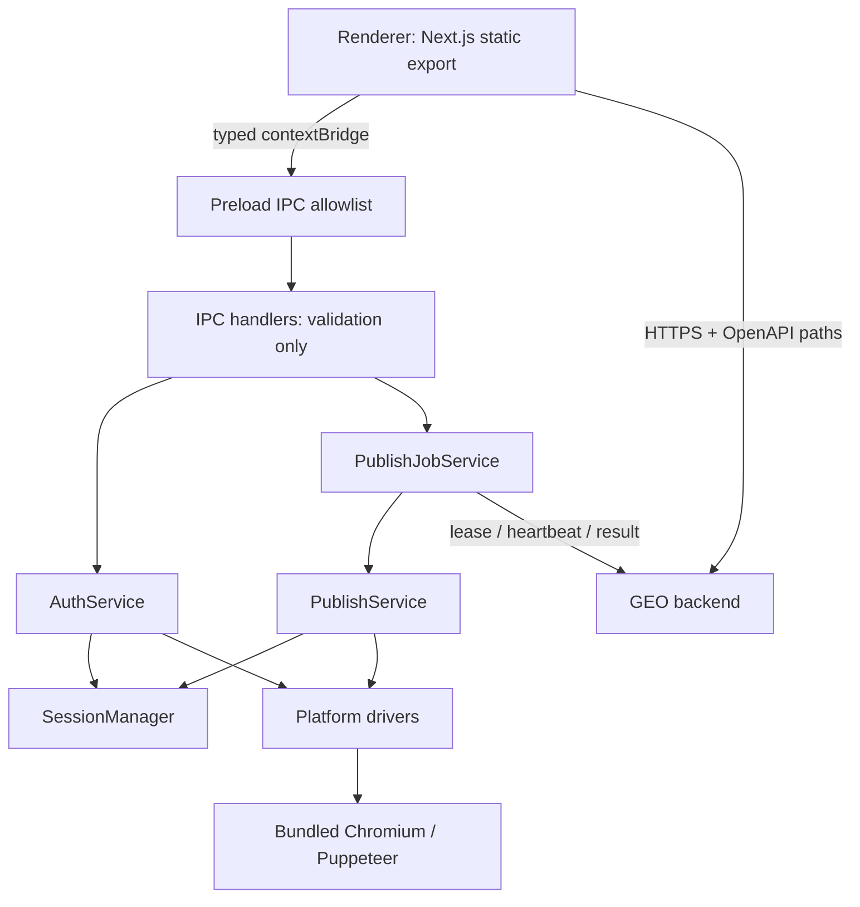
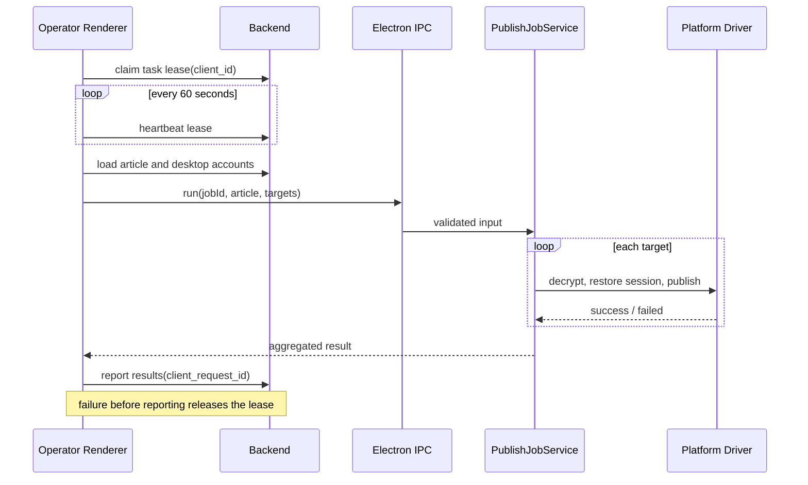

# GeoClient 架构

> 当前实现基线：2026-07-15

## 1. 架构目标

GeoClient 需要同时满足三个约束：

1. 同一仓库生成企业用户端和运营执行端，但两个 Renderer 产物不能互相泄漏页面或逻辑。
2. 平台自动化运行在 Electron 主进程，Renderer 不接触 Node.js、Puppeteer 或明文授权信息。
3. 运营端可以排他领取后端发布任务，并发执行、持续续租、幂等上报。

## 2. 当前分层

### Renderer

- `app/` 只负责路由。
- `components/pages/client` 和 `components/pages/operator` 隔离业务页面。
- `NEXT_PUBLIC_APP_MODE` 在构建前写入标记，构建后再次校验；缺失或非法模式会直接失败。
- Zustand 只持久化用户展示信息和 UI 状态，访问令牌不进入 localStorage。
- Renderer 只能引用 `lib/platform-manifest` 的纯展示数据，不能打入 Puppeteer 平台驱动。

### API

- `openapi.json` 是接口契约源。
- `openapi-typescript` 生成 `lib/api/generated/openapi.d.ts`。
- `apiPath()` 只接受 OpenAPI 中存在的路径模板，并负责参数编码。
- `lib/api/{auth,client,operator,desktop,settings}.ts` 按业务边界拆分。
- Axios 拦截器统一注入令牌和处理 401。

### Electron 边界

- `sandbox: true`、`contextIsolation: true`、`nodeIntegration: false`。
- preload 只暴露窗口、授权、发布任务、发布进度和安全会话接口。
- IPC handler 对平台名、类型、任务结构、凭据长度等进行运行时校验。
- 主窗口禁止跳转到非本地 Renderer 地址，拒绝权限请求，并在正式包中注入 CSP。
- 外部链接只允许 HTTPS；开发模式可额外打开 HTTP。

### 主进程服务

- `SessionManager`：以 sessionId 管理多个 Puppeteer 会话并统一清理。
- `AuthService`：登录窗口、Cookie/localStorage 白名单抓取、凭据回放。
- `CredentialService`：使用共享 AES-256-GCM 生成和读取 `aes:v2:` 授权密文，供用户端授权和运营端任务执行跨客户端使用。
- `PublishService`：打开发布页并调用平台的 `publishArticle` 驱动。
- `PublishJobService`：任务去重、排队、并发上限、取消和聚合进度。
- `logger.ts`：控制台结构化输出，同时写入 5 MiB 轮转的 `main.log`。

## 3. 发布任务流程

当前每个进程最多并行执行两个 Job；同一 `jobId` 的重复调用复用同一个 Promise。结果上报使用同一 `jobId` 作为后端幂等键。

## 4. 平台扩展

### 新增媒体平台

1. 在 `lib/platform-manifest/index.ts` 添加纯元数据。
2. 在 `lib/platforms/<id>/index.ts` 实现 `PlatformPublisher`。
3. 在 `lib/platforms/registry.ts` 注册驱动。
4. 根据平台需要声明 Cookie 和 localStorage 持久化白名单。
5. 要支持自动发布，必须实现 `publishArticle(page, article)`，并补充驱动级测试或可重复诊断脚本。

### 新增模型平台

1. 在 manifest 中添加 `kind: model` 元数据。
2. 在 `lib/model-platforms/<id>/index.ts` 添加认证配置。
3. 在模型注册表中注册。
4. 只保存恢复登录所必需的 Cookie/localStorage 键。

### 新增 API

1. 先更新 `openapi.json`。
2. 执行 `pnpm api:generate`。
3. 在对应领域 API 文件中使用 `apiPath()`。
4. 执行 `pnpm check`，提交 OpenAPI 与生成类型。

## 5. 构建和运行

- Renderer 构建标记位于导出目录的 `build-mode.json`。
- 安装包不内置 Chromium；用户在系统设置中选择本机 Google Chrome 可执行文件。
- Chrome 路径保存在系统用户级 `GeoHelper/runtime-settings.json`，client/operator 共用该配置。
- 平台授权、媒体发布和 GEO 检测统一通过 `launchBrowser()` 使用已配置的系统 Chrome；路径缺失或失效时直接提示用户重新选择。
- client/operator 使用独立 appId、productName 和输出目录。

## 6. 尚需外部系统配合的边界

以下事项不能只修改 geoclient 完成：

1. **跨设备凭据安全增强**：当前版本使用共享 AES 密钥满足跨客户端发布；后续版本应升级为 KMS/公钥信封加密和短期任务解封，消除安装包内共享密钥风险。详见安全说明。
2. **运营全局日志**：当前 OpenAPI 没有管理员全局发布日志接口，运营日志页只能明确展示能力缺失。
3. **签名、公证、更新源**：证书、账号和发布 URL 属于部署密钥与基础设施，仓库只提供可签名的 builder 配置。

这些边界必须在生产发布清单中作为阻断项，而不是在客户端中用假接口或静态密钥绕过。
