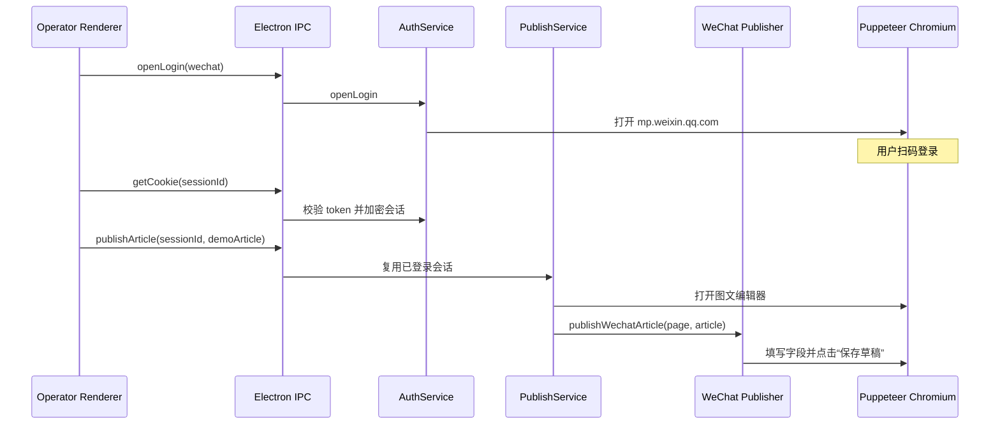

# 微信公众号 Puppeteer 自动发布示例

> 当前示例只自动填写并保存到草稿箱，不执行群发。这样既能验证完整浏览器自动化链路，也不会意外向真实关注者发送测试文章。

## 运行入口

### 独立脚本验证

执行：

```bash
pnpm demo:wechat-draft
```

脚本会打开一个独立的可见 Chromium，并复用
`tmp-auth-diagnose/wechat-draft-profile` 中的本地登录态。首次运行时扫码登录，随后脚本会打开新版图文编辑器，填入固定模拟文章并保存草稿。浏览器默认保持打开，检查完成后关闭窗口或按 `Ctrl+C`；如需保存成功后自动关闭，可执行：

```bash
WECHAT_KEEP_OPEN=0 pnpm demo:wechat-draft
```

登录等待时间默认 5 分钟，可以通过 `WECHAT_LOGIN_TIMEOUT_MS` 调整。失败时会在已忽略版本管理的 `tmp-auth-diagnose/` 中写入诊断截图，日志中的公众号 token 会被隐藏。

### 运营端界面验证

1. 执行 `pnpm dev:operator`。
2. 登录运营端并进入“发布管理”。
3. 在“多平台文章自动发布示例”中选择“微信公众号”，然后点击“打开微信公众号登录”。
4. 在 Puppeteer 浏览器中扫码并进入公众号后台。
5. 回到运营端点击“填充并保存草稿”。

示例文章定义在 `lib/publish-demos/media.ts`，不会写入后端文章数据。其它媒体平台的验证方式见[多平台发布模拟](MEDIA_PUBLISH_EXAMPLE.md)。

## 调用链



## Renderer 示例

```ts
const login = await window.electronAPI.platformAuth.openLogin('wechat', 'media')

// 用户在 Puppeteer 窗口完成扫码后执行：
const credentials = await window.electronAPI.platformAuth.getCookie(login.sessionId)
if (!credentials.ok) throw new Error(credentials.message)

const result = await window.electronAPI.platformAuth.publishArticle(
  'wechat',
  credentials.encryptedSecret,
  MEDIA_DEMO_ARTICLE,
  'media',
  login.sessionId,
)
if (!result.ok) throw new Error(result.message)
```

Renderer 只能通过 preload 白名单调用上述接口。Puppeteer、Cookie 解密和 DOM 操作都留在 Electron 主进程中。

## 平台驱动关键点

微信公众号实现位于 `lib/platforms/wechat/`：

- `auth.ts`：只把包含公众号后台 `token` 的 URL 视为已登录。
- `publish.ts`：集中维护标题、作者、摘要、正文编辑器和封面选择器。
- `index.ts`：将登录校验、发布 URL 构建器和文章填充驱动注册为 `wechatPublisher`。
- `publish.test.ts`：模拟 Puppeteer Page，验证字段填充和草稿按钮安全策略。

保存草稿时使用按钮文本精确匹配，只接受“保存为草稿”“保存草稿”“保存”。任何包含“群发”或“发布”的按钮都不会被自动点击；如果公众号后台改版导致选择器失效，驱动会报错并停留在浏览器页面，便于人工检查。

## 后续扩展

若要实现真正的群发，应单独增加显式发布模式、二次确认、账号权限检查、预览验证和可审计结果回传，不能复用当前草稿按钮逻辑直接点击未知主按钮。
