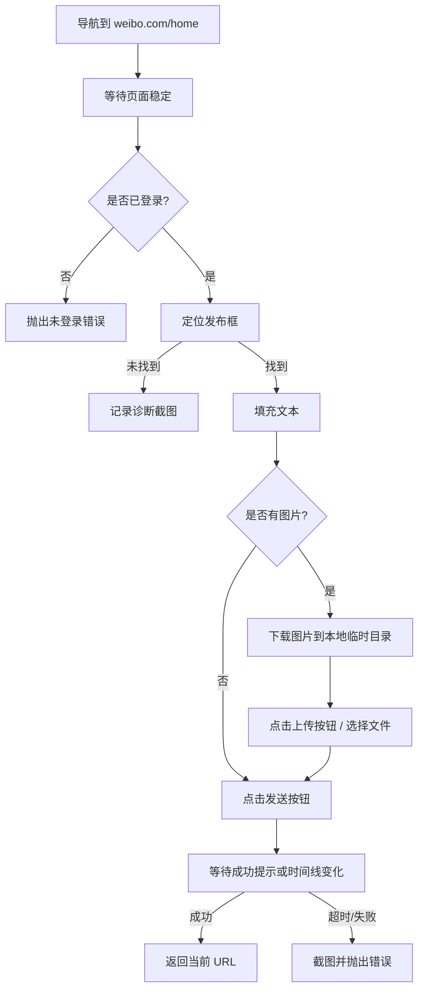

# 微博发文模块设计

> 本文档面向 GEO 桌面客户端（geoclient）的微博自动发文能力，说明当前状态、设计决策、实现要点与验证计划。

## 1. 背景与目标

GEO 内容生产闭环要求文章生成后能自动分发到企业绑定的自媒体账号。微博是国内重要的分发渠道之一，需要支持：

- **普通微博**：短文本 + 多图，适合 GEO 生成的精华摘要/品牌口碑内容。
- **头条文章**：长文，适合完整品牌故事/产品解读（二期可选）。

当前首要目标是让**普通微博**的自动发布跑通、稳定、可审计。

## 2. 微博平台特性

| 特性 | 当前限制 | 设计影响 |
| --- | --- | --- |
| 普通微博字数 | 约 2000 字（实测安全 1800 字） | 超长内容必须截断，避免发布失败 |
| 普通微博图片 | 最多 18 张（历史 9 张，兼容按 9 张处理） | 正文+封面去重后切片上传 |
| 编辑器形态 | 首页顶部发布框，动态渲染 | 需要多轮重试 + 兜底选择器 |
| 登录态 | `weibo.com` 域名下 cookie 即可 | cookieDomain 用 `.weibo.com` |
| 发布成功反馈 | 首页 toast + 时间线刷新，不一定跳转 | 不能依赖 URL 变化判断成功 |
| 反爬/风控 | 频繁发文会触发验证码或限制 | 需要人工兜底 + 失败截图 |

## 3. 当前实现状态

### 3.1 后端配置

数据库 `cfg_publish_channels` 已配置：

- `driver_type = 4` 映射到客户端 `weibo` 驱动
- `login_url = https://weibo.com`

见迁移文件 `kratos-svr/migrations/000019_platform_driver_configuration.up.sql`。

### 3.2 客户端驱动

文件位置：

- `geoclient/lib/platforms/weibo/index.ts`：注册 `weiboPublisher`
- `geoclient/lib/platforms/weibo/publish.ts`：普通微博发布逻辑
- `geoclient/lib/platform-manifest/index.ts`：`driverIds.media[4] = 'weibo'`

当前实现能力：

- 打开 `https://weibo.com/home`
- 定位首页发布框（textarea / contenteditable）
- 填充标题 + 摘要/正文（超长截断）
- 提取 content/cover 图片，最多 9 张
- 点击“图片”按钮上传
- 点击“发送/发布”按钮
- 等待发送成功提示或 URL 变化

状态：**初版已完成，尚未完成端到端验证**（见 2026-07-29 工作日志）。

## 4. 模块设计

### 4.1 数据流

```text
企业端创建发布任务 -> 后端 pub_tasks 记录
                          |
运营端点击发布/重试 -> /api/worker/v1/tasks:claim
                          |
              Electron 主进程 PublishJobService
                          |
              AuthService.prepareAuthenticatedPage
                          |
              weiboPublisher.publishArticle(page, article)
                          |
              微博首页发布框 + 图片 + 发送
                          |
              返回 publishedUrl / 失败截图
```

### 4.2 驱动接口

```ts
// lib/platforms/types.ts
export interface PlatformPublisher {
  id: string
  loginUrl: string
  publishUrl: string
  cookieSiteUrl?: string
  cookieDomain?: string
  assertAuthenticated?: (page: Page) => Promise<void>
  publishArticle?: (page: Page, article: PublishArticleInput) => Promise<string | void>
}
```

微博驱动实现：

```ts
// lib/platforms/weibo/index.ts
export const weiboPublisher: PlatformPublisher = {
  ...manifest,
  publishUrl: 'https://weibo.com/home',
  cookieSiteUrl: 'https://weibo.com',
  cookieDomain: '.weibo.com',
  assertAuthenticated: assertWeiboAuthenticated, // 待补齐
  publishArticle: publishWeiboArticle,
}
```

### 4.3 普通微博发布流程



## 5. 关键实现细节

### 5.1 登录态检测

新增 `assertWeiboAuthenticated`：

- 检查页面是否包含个人头像、昵称、首页 feed 流等登录态标识。
- 若页面被重定向到 `https://weibo.com/login.php` 或登录框，立即抛出 `未登录微博`。

```ts
async function assertWeiboAuthenticated(page: Page) {
  const loggedIn = await page.evaluate(() => {
    const text = document.body?.innerText || ''
    return document.querySelector('[class*="user"]') !== null ||
           text.includes('首页') || text.includes('关注') || text.includes('推荐')
  })
  if (!loggedIn) throw new Error('未登录微博')
}
```

### 5.2 文本处理

- 优先使用 `article.summary`，无摘要时使用正文纯文本。
- 标题与正文用 `\n\n` 分隔。
- 总长度超过 `1800` 时截断并追加 `...`。
- 过滤 Markdown 标记（`#`、`*`、`-` 等），因为普通微博是纯文本。

### 5.3 图片处理

- 收集顺序：`cover`（如果有）→ 正文 `` 去重。
- 远程图片优先通过 `page.evaluate(fetch)` 下载，继承当前 cookie / referer，避免防盗链失败。
- 图片格式通过文件头识别（jpg/png/gif/webp），兜底用 URL 扩展名。
- 上传前压缩到微博可接受大小（单张建议 < 20MB）。
- 目前最多处理 9 张，后续可扩展到 18 张。

### 5.4 发布框定位策略

按优先级匹配可见元素：

1. `textarea[placeholder*="新鲜事"]`, `textarea[placeholder*="分享"]`, `textarea[placeholder*="说点什么"]`
2. `[contenteditable="true"]` 且 placeholder/aria-label 含“新鲜事/分享/微博”
3. 兜底：遍历所有 textarea/contenteditable，按文案模糊匹配

每轮间隔 1 秒，最多重试 5 次。

### 5.5 图片上传按钮定位

- 优先文本匹配：包含“图片”二字的可见 `a/div/span/button/li`。
- 点击后等待 `input[type="file"]` 出现。
- 使用 Puppeteer `elementHandle.uploadFile(...paths)` 上传。
- 上传后等待 3 秒，让微博完成本地预览。

### 5.6 发送按钮定位

- 文本精确/包含匹配：“发送”、“发布”。
- 限制在发布框附近（`rect.top < 400`），避免误点页面其它按钮。
- 点击后监听：
  - body 文本出现“发送成功/发布成功/已发送/发送中”
  - 或当前 URL 发生变化

超时 30 秒；若超时但页面无错误提示，可尝试人工确认是否已发布。

### 5.7 返回 publishedUrl

微博普通微博发布后通常不会跳转到单条微博页，而是停留在首页并刷新时间线。因此：

- 优先尝试从页面最新时间线中抓取第一条微博链接。
- 若抓不到，返回 `https://weibo.com/home`。
- 后端/前端需要接受“ publishedUrl 可能不是单条微博永久链接”的语义。

## 6. 风险与兜底

| 风险 | 影响 | 兜底方案 |
| --- | --- | --- |
| 微博页面改版 | 发布框/图片按钮/发送按钮选择器失效 | 增加诊断日志 + 多轮兜底匹配；失败后人工接管 |
| 登录态过期 | 发布时报未登录 | `assertAuthenticated` 提前检测；运营端重新授权 |
| 内容触发风控 | 发送后弹出验证码或频繁操作提示 | 截图记录；任务标记失败；人工在浏览器中继续 |
| 远程图片下载失败 | 正文缺图 | 跳过失败图片并记录日志；至少保证文本发出 |
| 超长内容 | 超出字数限制 | 发布前截断 + 省略号 |
| 发布成功判断不准 | 任务状态与实际不一致 | 超时后人工确认；后续通过微博搜索/时间线二次校验 |

## 7. 测试验证清单

### 7.1 本地验证

```bash
cd D:\geo\geoclient
pnpm run build:electron
```

### 7.2 端到端验证步骤

1. 企业端：
   - 进入“平台账号管理” → 添加微博账号
   - 在 Puppeteer 窗口中扫码/密码登录微博
   - 确认授权成功
2. 企业端：
   - 选择已生成的文章
   - 创建微博发布任务（普通微博）
3. 运营端：
   - 进入“发布管理” → 找到微博任务
   - 点击“执行发布”或“重试”
4. 观察：
   - Puppeteer 窗口正确打开 `weibo.com/home`
   - 发布框被填充（标题 + 正文，无 Markdown 标记）
   - 图片正确上传并显示预览
   - 点击发送后出现成功提示
   - 任务状态变为“成功”，返回 publishedUrl

### 7.3 失败排查

- 若找不到发布框：检查 `publish-evidence/publish-failed-weibo-*.png`。
- 若提示未登录：重新在企业端授权微博账号。
- 若图片未上传：检查图片 URL 是否可访问，或尝试减少图片数量。

## 8. 待办

- [x] 补齐 `assertWeiboAuthenticated` 登录态检测。
- [x] 将图片下载从 `fetch` 改为 `page.evaluate(fetch)`，提升防盗链成功率。
- [x] 增强发布成功检测（按钮变灰、时间线新内容、URL 变化、文案提示）。
- [ ] 支持从发布后时间线抓取最新微博链接作为 `publishedUrl`。
- [ ] 扩展图片上限到 18 张并验证。
- [ ] 增加“发送失败/频繁操作/验证码”等异常检测。
- [ ] 编写 `weibo/publish.test.ts` 单元测试。
- [ ] 完成端到端发布验证并记录结果。
- [ ] （二期）调研并支持微博头条文章编辑器。
