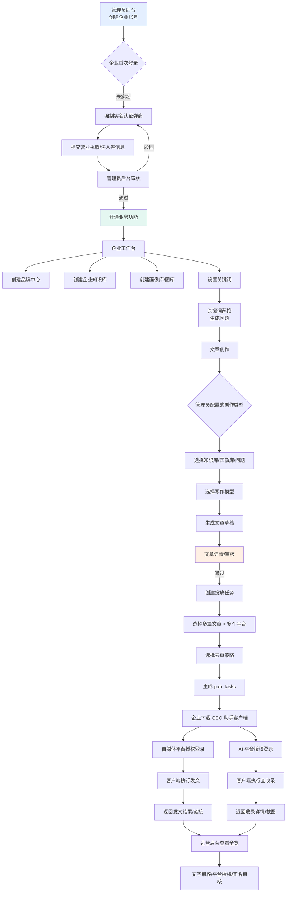
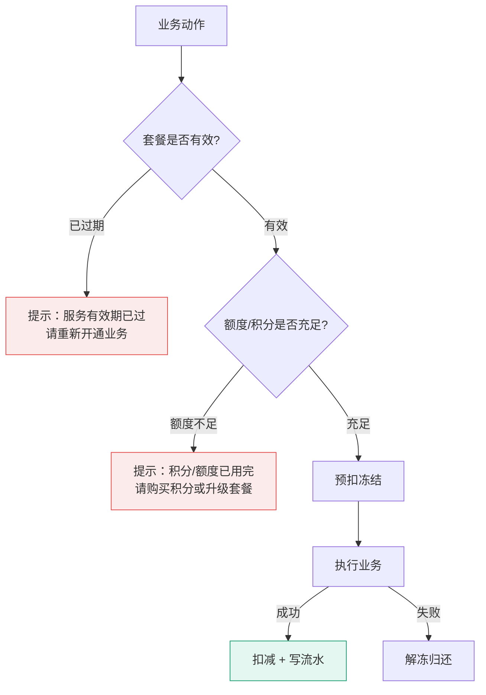
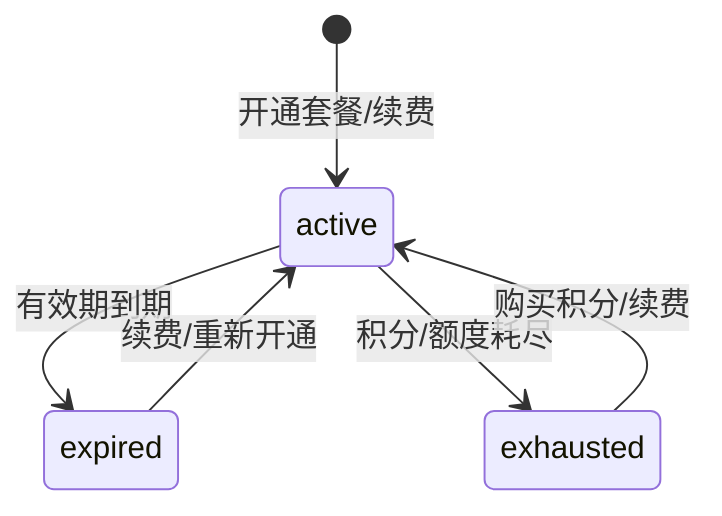
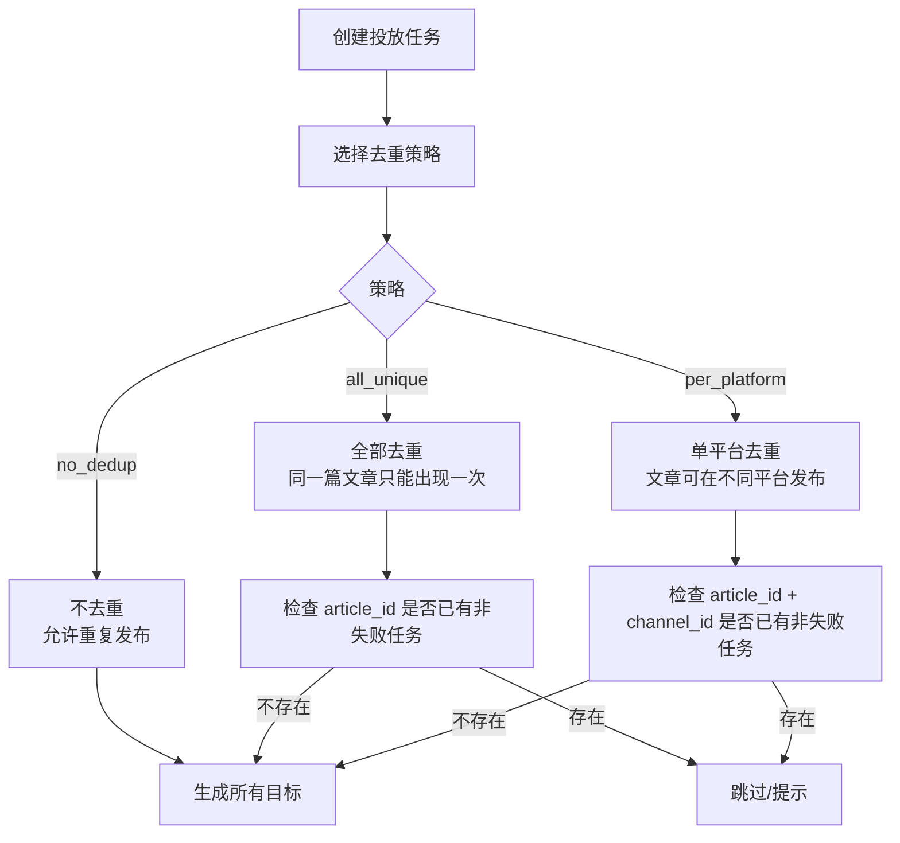
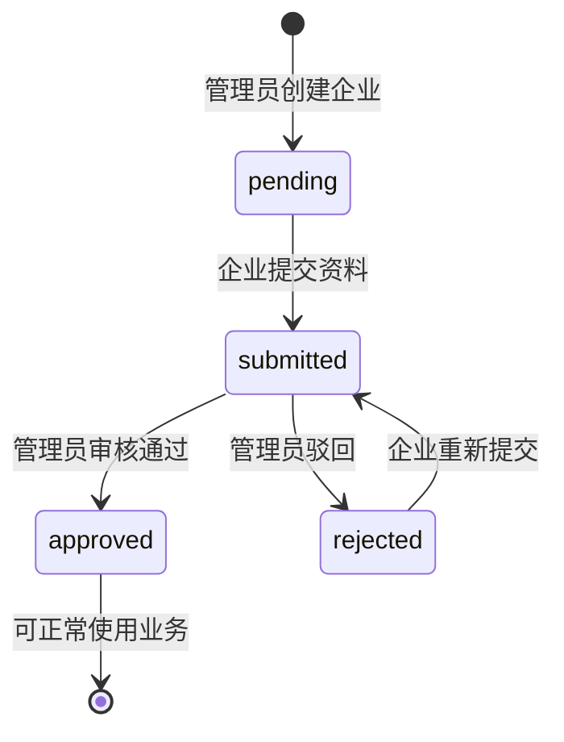
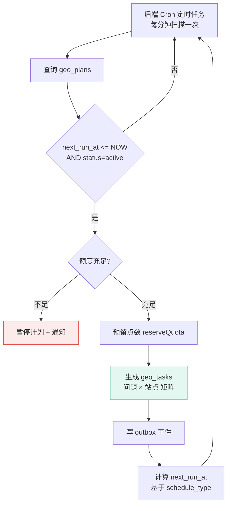
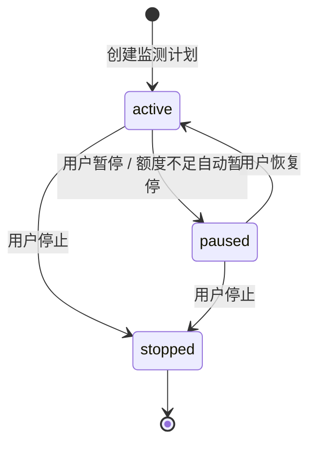
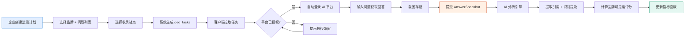

# GEO 套餐、计费、投放与实名认证设计文档

> 版本：v1.0（2026-08-05）  
> 范围：管理员后台（Ant Design Pro）、企业工作台（Next.js userconsole）、Go Kratos 后端  
> 目标：把“套餐购买/开通 → 点数计费 → 多文章多平台投放 → 实名认证拦截”串成可落地的闭环。

---

## 1. 需求总览

| 模块 | 核心诉求 | 当前状态 |
|---|---|---|
| 套餐 | 管理员配置套餐 → 企业工作台可购买/管理员可开通 → 显示到期时间与剩余额度 | 表结构已有 `ent_plans`、`ent_subscriptions`、`ent_quota_limits`，但缺少价格、购买记录、企业自购入口 |
| 计费 | 按“旗引”点数规则扣费：AI 蒸馏、创作、投稿、复刻、收录查询等 | 仅有 `cfg_system_settings`，未与额度/点数钱包打通 |
| 投放任务 | 一篇文章多平台 / 多文章多平台，支持"轮询分配"；去重策略：不去重/全部去重/单平台去重 | `pub_plans` 仅需改字段可空 + 加 `dedup_strategy`，`pub_tasks` 补 `article_id`，不新增中间表 |
| 实名认证 | 企业开号后强制弹窗提交实名，管理员审核通过前业务功能不可用；开发阶段可绕过 | 当前无实名相关字段与拦截 |
| 全局流程 | 管理员开号 → 实名 → 开通业务 → 知识/品牌/关键词 → 文章创作 → 审核 → 投放 → 客户端授权 → GEO 监测/运营 | 需要一张端到端流程图 |

---

## 2. 全局操作流程图



---

## 3. 套餐与计费模块设计

### 3.1 当前数据基础

已有表（见 `kratos-svr/internal/data/model/enterprise.go`、`table.go`）：

- `ent_plans`：套餐基础信息
- `ent_plan_limits`：套餐包含的额度指标
- `ent_plan_features`：套餐包含的功能开关
- `ent_subscriptions`：企业订阅记录
- `ent_quota_limits`：企业实时额度（used/reserved/limit）
- `ent_usage_ledgers`：额度预留/扣减流水
- `ent_points_ledgers`：点数调整流水（仅有流水，缺少余额表）
- `cfg_system_settings`：系统配置（可用于存储点数单价）

### 3.2 核心概念

| 概念 | 说明 |
|---|---|
| **套餐 Plan** | 包含功能开关 + 周期性额度（文章生成次数、GEO 查询次数等）+ 可选赠送点数 |
| **Subscription** | 企业生效中的套餐实例，记录 `starts_at`、`expires_at`、`status` |
| **额度 Quota** | 周期性资源计数，如 `article_generations`、`geo_queries`、`publish_tasks` |
| **点数 Credits** | 独立于额度的“点数钱包”，用于按次扣费（如 AI 诊断 10 点/次） |
| **计费规则** | 管理员在后台配置每个动作消耗的点数，存储在 `cfg_system_settings` |
| **订单 Order** | 企业自购套餐或点数充值的记录，需要支付/审核状态 |

### 3.3 数据模型变更

#### 3.3.1 `ent_plans` 增加商业字段

```sql
ALTER TABLE ent_plans
  ADD COLUMN description VARCHAR(1024) AFTER name,
  ADD COLUMN monthly_price_minor_units BIGINT NOT NULL DEFAULT 0,
  ADD COLUMN yearly_price_minor_units  BIGINT NOT NULL DEFAULT 0,
  ADD COLUMN currency CHAR(3) NOT NULL DEFAULT 'CNY',
  ADD COLUMN billing_cycle VARCHAR(32) NOT NULL DEFAULT 'monthly',
  ADD COLUMN visible_to_enterprise BOOLEAN NOT NULL DEFAULT TRUE,
  ADD COLUMN sort_order INT NOT NULL DEFAULT 0;
```

- `*_price_minor_units`：金额最小单位（分），避免浮点误差。
- `visible_to_enterprise`：控制是否在企业工作台“购买套餐”列表中显示。

#### 3.3.2 新增 `ent_subscription_orders` 购买记录表

```sql
CREATE TABLE ent_subscription_orders (
  id BIGINT UNSIGNED NOT NULL AUTO_INCREMENT,
  enterprise_id BIGINT UNSIGNED NOT NULL,
  plan_id BIGINT UNSIGNED,
  order_type VARCHAR(32) NOT NULL,        -- plan / credits
  cycle VARCHAR(32),                      -- monthly / yearly
  amount_minor_units BIGINT NOT NULL DEFAULT 0,
  currency CHAR(3) NOT NULL DEFAULT 'CNY',
  credits_amount BIGINT,                  -- 充值点数时有效
  status VARCHAR(32) NOT NULL,            -- pending / paid / approved / cancelled / refunded
  source VARCHAR(32) NOT NULL,            -- enterprise_self / admin_grant
  paid_at DATETIME(6),
  approved_at DATETIME(6),
  approved_by BIGINT UNSIGNED,
  remark TEXT,
  created_at DATETIME(6) NOT NULL,
  updated_at DATETIME(6) NOT NULL,
  deleted_at DATETIME(6),
  PRIMARY KEY (id),
  KEY idx_ent_subscription_orders_enterprise (enterprise_id, status, created_at)
) ENGINE=InnoDB DEFAULT CHARSET=utf8mb4;
```

- 企业自购套餐 → 状态 `pending` → 运营确认到账后 `approved` → 自动创建/续期 `ent_subscriptions`。
- 管理员后台开通 → 直接 `approved`，并写审计日志。

#### 3.3.3 新增 `ent_points_balances` 点数余额表

```sql
CREATE TABLE ent_points_balances (
  id BIGINT UNSIGNED NOT NULL AUTO_INCREMENT,
  enterprise_id BIGINT UNSIGNED NOT NULL,
  balance BIGINT NOT NULL DEFAULT 0,
  frozen BIGINT NOT NULL DEFAULT 0,
  version BIGINT UNSIGNED NOT NULL DEFAULT 1,
  created_at DATETIME(6) NOT NULL,
  updated_at DATETIME(6) NOT NULL,
  PRIMARY KEY (id),
  UNIQUE KEY uk_ent_points_balance_enterprise (enterprise_id)
) ENGINE=InnoDB DEFAULT CHARSET=utf8mb4;
```

- 余额与流水分离：`ent_points_balances` 用于快速校验；`ent_points_ledgers` 用于对账。

#### 3.3.4 计费规则存储

使用 `cfg_system_settings`，`namespace='billing'`，`key='unit_costs'`，`value_json` 示例：

```json
{
  "ai_distill": { "title": "AI蒸馏(次)", "points": 1, "unit": "次" },
  "article_generation": { "title": "创作文章(篇)", "points": 1, "unit": "篇" },
  "article_publish": { "title": "投稿文章(篇)", "points": 0, "unit": "篇" },
  "article_replicate": { "title": "复刻爆文(篇)", "points": 2, "unit": "篇" },
  "article_with_knowledge": { "title": "创作文章附带知识库(篇)", "points": 1, "unit": "篇" },
  "inclusion_query": { "title": "查询收录(问题/次)", "points": 0.5, "unit": "问题/次" },
  "online_inclusion_query": { "title": "联网查收录(每次)", "points": 1, "unit": "次" },
  "index_query": { "title": "指数查询/次", "points": 10, "unit": "次" },
  "seo_publish": { "title": "seo发布/篇", "points": 1, "unit": "篇" },
  "screenshot_inclusion_query": { "title": "带截图查收录(元/次)", "points": 0.05, "unit": "元/次" },
  "ai_diagnosis": { "title": "AI诊断(元/次)", "points": 10, "unit": "次" },
  "ai_diagnosis_with_suggestion": { "title": "AI诊断+优化建议(元/次)", "points": 2, "unit": "次" }
}
```

> 注意：截图中“元/次”实际上是点数单价，建议统一用 `points` 字段表示，货币字段仅在需要按人民币计费时启用。

### 3.4 计费流程



扣点逻辑建议封装在统一计费服务 `BillingService`：

```go
// kratos-svr/app/user/internal/biz/billing.go
func (uc *BillingUsecase) Charge(ctx context.Context, cmd ChargeCommand) error

type ChargeCommand struct {
    EnterpriseID uint64
    Metric       string   // 额度指标，空字符串表示只扣点
    Amount       int64    // 额度数量
    PointsMetric string   // 点数计费项，如 article_generation
    Quantity     int64    // 计费次数
    ReferenceType string
    ReferenceID  uint64
    IdempotencyKey string
}
```

### 3.5 服务生命周期：到期与耗尽

套餐整体有 3 种状态，对应 3 种企业端提示：



#### 3.5.1 到期判定

- **触发时机**：每次业务操作前，或定时任务（午夜 Cron）检查。
- **判定条件**：`ent_subscriptions.expires_at < NOW()`。
- **动作**：`subscription.status` 从 `active` 更新为 `expired`，额度不再重置。
- **前端提示**：全局横幅 "服务有效期已过，请重新开通业务" + [立即续费] 按钮。

#### 3.5.2 积分/额度耗尽

- **触发时机**：每次计费扣减后，检查余额。
- **判定条件**：`ent_points_balances.balance <= 0` 或关键额度 `ent_quota_limits.used_value >= limit_value`。
- **动作**：拒绝后续计费请求，业务操作返回 `ErrQuotaExhausted` / `ErrPointsExhausted`。
- **前端提示**：全局横幅 "积分/额度已用完，请购买积分或升级套餐" + [去购买] 按钮。

#### 3.5.3 前端拦截位置

| 触发场景 | 拦截点 | 提示内容 |
|---|---|---|
| 套餐到期 | 业务入口（创作/投放/监测）点击时 | "服务有效期已过，请重新开通业务" |
| 套餐到期 | Dashboard 红框区域 | 状态变红："已过期" + 到期日期 |
| 积分用完 | 计费操作响应拦截 | "积分已用完，请购买积分或升级套餐" |
| 积分即将用完 | Dashboard 红框区域 | 进度条变红："剩余 3% 请及时续费" |

建议在 `console-shell.tsx` 增加全局拦截：任何需要计费的操作在 API 调用前先检查 `profile.subscriptionStatus` 和 `profile.pointsBalance`，不符合条件直接弹出拦截弹窗，不发送请求。

### 3.6 企业工作台提示位置

到期/耗尽提示统一在两个位置展示：

1. **顶部横幅**：所有页面顶部常驻条，根据当前状态切换文案与按钮。
2. **套餐与用量页**：在已有的 `SubscriptionWorkspace` 组件中显示当前状态、到期时间、剩余额度。

不需要在 `DashboardWorkspace` 单独做卡片，避免运营管理平台和管理后台重复展示。

### 3.7 管理员后台购买记录

新增页面，**这是管理员后台唯一需要新增的套餐相关页面**：

- 路径：`/admin/business/subscription-orders`
- 列表字段：
  - 订单号（系统生成 `ENT-yyyymmdd-序号`）
  - 企业名称、套餐名称
  - 金额、来源（企业自购 / 管理员开通）、状态、时间
- 操作：
  - 确认到账（pending → approved，自动激活订阅）
  - 取消订单（pending → cancelled）
  - 备注（写入 `ent_subscription_orders.remark`）
- 额外入口：在企业详情页加 "开通套餐" 按钮，弹窗选择套餐与有效期，提交后直接生成 `approved` 订单。

> 管理员 Dashboard 不单独展示套餐卡片，所有购买/开通操作都从购买记录页进入。

### 3.8 API/页面清单

| 端 | 新增/改动 | 说明 |
|---|---|---|
| admin | `Plan` 增加价格字段 | `api/admin/v1/plan.proto` |
| admin | 新增 `SubscriptionOrderService` | 列表/确认/开通，路径 `/admin/business/subscription-orders` |
| admin | 企业详情页"开通套餐"入口 | 生成 `approved` 订单 |
| admin | 系统配置新增"点数扣费规则"页 | `cfg_system_settings` namespace=billing，12 项单价配置 |
| user | `GetProfile` 返回 `pointsBalance` | `api/user/v1/auth.proto` / `app/user/internal/data/auth.go` |
| user | 新增 `ListPurchasablePlans`、`CreateSubscriptionOrder` | 企业自购 |
| user | "套餐与用量"页增加购买按钮 | `enterprise-pages.tsx`，全局横幅拦截到期/耗尽 |
| user | 全局拦截器 | `console-shell.tsx` 在 API 调用前校验套餐状态 |

### 3.9 计费规则：基于旗引的 12 项点数配置

#### 3.9.1 设计依据

完全参考**旗引 AI GEO 平台**的后台计费配置（见用户提供的截图），共 12 个计费项，按"次数/篇/元"三种单位计量。

#### 3.9.2 完整计费项映射

| 序号 | 变量标题 | 业务场景 | 计价单位 | 默认点数（旗引参考） | 平台枚举 |
|---|---|---|---|---|---|
| 1 | AI蒸馏(次) | 关键词蒸馏：基于关键词生成目标问题 | 次 | 1 | `ai_distill` |
| 2 | 创作文章(篇) | AI 文章创作（不含知识库） | 篇 | 1 | `article_generation` |
| 3 | 投稿文章(篇) | 文章进入投放任务 | 篇 | 0 | `article_publish` |
| 4 | 复刻爆文(篇) | 基于已有爆文生成变体 | 篇 | 2 | `article_replicate` |
| 5 | 创作文章附带知识库(篇) | AI 文章创作（指定知识库） | 篇 | 1 | `article_with_knowledge` |
| 6 | 查询收录(问题/次) | 监测计划查 AI 收录 | 问题/次 | 0.5 | `inclusion_query` |
| 7 | 联网查收录(每次) | 启用联网搜索的查收录 | 次 | 1 | `online_inclusion_query` |
| 8 | 指数查询/次 | 关键词指数查询 | 次 | 10 | `index_query` |
| 9 | seo发布/篇 | SEO 站点发布 | 篇 | 1 | `seo_publish` |
| 10 | 带截图查收录(元/次) | 查收录时附带截图证据 | 元/次 | 0.05 | `screenshot_inclusion_query` |
| 11 | AI诊断(元/次) | AI 自动诊断文章/账号 | 元/次 | 10 | `ai_diagnosis` |
| 12 | AI诊断+优化建议(元/次) | AI 诊断 + 优化建议 | 元/次 | 2 | `ai_diagnosis_with_suggestion` |

> 序号 10~12 单位写的是"元"，但实际是点数（避免与套餐金额混淆），由 `points` 字段统一承载。

#### 3.9.3 存储格式

`cfg_system_settings` 单行记录：

```json
{
  "namespace": "billing",
  "key": "unit_costs",
  "value_json": {
    "ai_distill":                     { "title": "AI蒸馏(次)",                  "points": 1,    "unit": "次" },
    "article_generation":             { "title": "创作文章(篇)",                "points": 1,    "unit": "篇" },
    "article_publish":                { "title": "投稿文章(篇)",                "points": 0,    "unit": "篇" },
    "article_replicate":              { "title": "复刻爆文(篇)",                "points": 2,    "unit": "篇" },
    "article_with_knowledge":         { "title": "创作文章附带知识库(篇)",      "points": 1,    "unit": "篇" },
    "inclusion_query":                { "title": "查询收录(问题/次)",           "points": 0.5,  "unit": "问题/次" },
    "online_inclusion_query":         { "title": "联网查收录(每次)",            "points": 1,    "unit": "次" },
    "index_query":                    { "title": "指数查询/次",                 "points": 10,   "unit": "次" },
    "seo_publish":                    { "title": "seo发布/篇",                  "points": 1,    "unit": "篇" },
    "screenshot_inclusion_query":     { "title": "带截图查收录(元/次)",         "points": 0.05, "unit": "元/次" },
    "ai_diagnosis":                   { "title": "AI诊断(元/次)",               "points": 10,   "unit": "次" },
    "ai_diagnosis_with_suggestion":    { "title": "AI诊断+优化建议(元/次)",       "points": 2,    "unit": "次" }
  }
}
```

#### 3.9.4 管理员后台配置页

路径：`/admin/settings/billing`

UI 结构（与旗引保持一致）：

```
┌──────────────────────────────────────────────────────┐
│  计费规则（点数配置）                            [保存] │
├──────────────────┬───────────────────────────────────┤
│  变量标题        │  变量值（点数）                    │
├──────────────────┼───────────────────────────────────┤
│  AI蒸馏(次)      │  [    1.0    ]                    │
│  创作文章(篇)    │  [    1.0    ]                    │
│  投稿文章(篇)    │  [    0.0    ]                    │
│  复刻爆文(篇)    │  [    2.0    ]                    │
│  创作文章附带知识库(篇) │  [    1.0    ]              │
│  查询收录(问题/次)  │  [    0.5    ]                 │
│  联网查收录(每次)  │  [    1.0    ]                  │
│  指数查询/次     │  [   10.0    ]                    │
│  seo发布/篇      │  [    1.0    ]                    │
│  带截图查收录(元/次) │  [    0.05   ]                │
│  AI诊断(元/次)   │  [   10.0    ]                    │
│  AI诊断+优化建议(元/次) │  [    2.0    ]             │
└──────────────────┴───────────────────────────────────┘
```

操作：

- 单项修改后即时保存（防丢失）。
- 一键恢复默认值按钮。
- 修改记录写入审计日志 `ops_audit_logs`。

#### 3.9.5 触发扣费的业务动作

| 计费项 | 触发点 | 扣费时机 | 额度预留? |
|---|---|---|---|
| `ai_distill` | 关键词蒸馏任务 | 创建任务时 | 是 |
| `article_generation` | 文章创作任务 | 创建任务时 | 是 |
| `article_replicate` | 复刻爆文任务 | 创建任务时 | 是 |
| `article_with_knowledge` | 文章创作 + 指定知识库 | 创建任务时 | 是 |
| `article_publish` | 创建投放任务 | 创建任务时 | 是（按 task 数） |
| `inclusion_query` | 创建 GEO 监测计划 | 创建任务时 | 是 |
| `online_inclusion_query` | 启用联网的 GEO 计划 | 创建任务时 | 是 |
| `index_query` | 指数查询 API | 调用前 | 否 |
| `seo_publish` | SEO 站点发布 | 发布时 | 是 |
| `screenshot_inclusion_query` | 含截图的查收录任务 | 创建任务时 | 是 |
| `ai_diagnosis` | 诊断 API 调用 | 调用前 | 否 |
| `ai_diagnosis_with_suggestion` | 诊断 + 建议 API 调用 | 调用前 | 否 |

#### 3.9.6 扣费逻辑统一封装

新增 `BillingService.Estimate` 与 `BillingService.Settle`：

```go
type BillingService interface {
    Estimate(ctx, enterpriseID, metric, quantity) (cost *ChargeCost, error)
    Reserve(ctx, enterpriseID, metric, quantity, ref) error  // 预留
    Settle(ctx, enterpriseID, reservationID) error            // 成功扣减
    Rollback(ctx, reservationID) error                        // 失败回滚
}
```

每次业务动作前调用 `Estimate` 拿到 cost，调用 `Reserve` 冻结点数；动作完成后 `Settle` 或 `Rollback`。这样配额/点数的账目始终平衡。

---

---

## 4. 投放任务改造：多文章 × 多平台 + 去重

### 4.1 当前问题与最小改动思路

`pub_plans` 当前强制绑定单篇文章：

```go
ArticleID         uint64 `gorm:"not null"`
ArticleSnapshotID uint64 `gorm:"not null"`
```

但观察 `pub_tasks` 发现：**每条 task 已经独立携带 `article_snapshot_id` + `publish_channel_id`**，不同 task 天生就能指向不同的文章和平台。因此瓶颈只在 `pub_plans` 的那两个 NOT NULL 字段。

**结论：不需要新增中间表，直接改两张现有表即可。**

### 4.2 表结构改造（最小改动）

```sql
-- 1. pub_plans：文章字段改为可空，增加去重策略
ALTER TABLE pub_plans
  MODIFY COLUMN article_id BIGINT UNSIGNED NULL,
  MODIFY COLUMN article_snapshot_id BIGINT UNSIGNED NULL,
  ADD COLUMN dedup_strategy VARCHAR(32) NOT NULL DEFAULT 'no_dedup'
    COMMENT '不去重=no_dedup / 全部去重=all_unique / 单平台去重=per_platform'
    AFTER failure_policy_json;

-- 2. pub_tasks：补上 article_id，用于去重查询和列表展示
ALTER TABLE pub_tasks
  ADD COLUMN article_id BIGINT UNSIGNED NOT NULL AFTER publish_plan_id,
  ADD KEY idx_pub_task_article (enterprise_id, article_id, publish_channel_id);

-- 3. 迁移历史数据：已有 pub_plans 的单文章数据写回对应的 pub_tasks
UPDATE pub_tasks t
  JOIN pub_plans p ON t.publish_plan_id = p.id
  SET t.article_id = p.article_id
  WHERE t.article_id = 0;
```

**就这三条 SQL，不建新表。** 数据关系变为：

```
pub_plans (投放计划 — 纯容器)
├── id=1, name="8月推广", dedup_strategy="per_platform", article_id=NULL
│
└── pub_tasks (计划下的任务 — 各自独立携带文章和平台)
    ├── article_id=10, article_snapshot_id=30, channel_id=1  →  文章A → 知乎
    ├── article_id=11, article_snapshot_id=31, channel_id=2  →  文章B → 头条
    └── article_id=12, article_snapshot_id=32, channel_id=1  →  文章C → 知乎
```

- `pub_plans.article_id` 保留但不强制，方便历史兼容；新计划不再填这个字段。
- 文章列表查询：`SELECT article_id FROM pub_tasks WHERE publish_plan_id=? GROUP BY article_id ORDER BY MIN(id)`。

### 4.3 任务矩阵生成算法

用户场景（快速模式）：3 篇文章 + 2 个平台，按选择顺序轮询分配：

| 文章顺序 | 平台顺序 | 生成 pub_task |
|---|---|---|
| 文章 1 | 平台 1 | article_id=1, channel_id=1 |
| 文章 2 | 平台 2 | article_id=2, channel_id=2 |
| 文章 3 | 平台 1 | article_id=3, channel_id=1 |
| 文章 4 | 平台 2 | article_id=4, channel_id=2 |
| ... | ... | ... |

> 注意：全部去重模式下 n 篇文章只会生成 n 条 task（一平台一篇）；单平台去重 / 不去重模式下 n 篇 x m 平台 = n*m 条 task。

算法伪代码：

```go
switch plan.DedupStrategy {
case "all_unique":
    // 每篇文章只分配一个平台，按轮询
    for i, art := range articles {
        platform := targets[i % len(targets)]
        createTask(ctx, planID, art.ID, art.SnapshotID, platform)
    }
case "per_platform", "no_dedup":
    // 每篇文章投所有平台
    for _, art := range articles {
        for _, platform := range targets {
            // per_platform 在此处调用去重检查
            createTask(ctx, planID, art.ID, art.SnapshotID, platform)
        }
    }
}
```

前端表单两种模式：

1. **快速模式**：选择 N 篇文章（拖拽排序）+ M 个平台/账号（拖拽排序），选去重策略，系统自动组合。
2. **高级模式**：矩阵勾选，逐行指定"哪篇文章 → 哪个平台 → 哪个账号"。

### 4.4 去重策略



去重判断依据：

- 查询 `pub_tasks` 中 `status NOT IN ('failed','cancelled','expired')` 的历史记录。
- `no_dedup`：仍允许创建，但前端提示风险。
- `all_unique`：排除已存在该 `article_id` 的任务。
- `per_platform`：排除已存在该 `(article_id, publish_channel_id)` 的任务。

### 4.5 API 变更（Proto）

`api/user/v1/publish_task.proto`：

```protobuf
message CreatePublishPlanRequest {
  string name = 1;
  string timezone = 2;
  int32 schedule_type = 3;
  google.protobuf.Timestamp scheduled_at = 4;
  string failure_policy_json = 5;
  string client_request_id = 6;
  string dedup_strategy = 7;              // 新增：no_dedup / all_unique / per_platform
  repeated uint64 article_ids = 8;        // 新增：文章 ID 列表（有序）
  repeated uint64 article_snapshot_ids = 9;// 新增：对应快照 ID 列表（与 article_ids 一一对应）
  repeated PublishTargetInput targets = 10;
  // 高级模式扩展（可选，后续迭代）
  // repeated PublishAssignment assignments = 11;
}
```

返回的 `PublishPlan` 增加 `dedup_strategy` 字段，而关联的文章列表通过 `ListPlanTasks` 查询 `pub_tasks` 聚合获得，不单独存表。

### 4.6 关键后端改动点

| 层 | 文件 | 改动 |
|---|---|---|
| Model | `internal/data/model/publish_task.go` | PublishPlan.ArticleID/ArticleSnapshotID 去掉 `not null`；PublishPlan 加 `DedupStrategy`；PublishTask 加 `ArticleID` |
| Biz | `app/user/internal/biz/publish_task.go` | PublishPlan.ArticleID 改为可选；Create 入参改为 `[]ArticleInput` + 去重策略 |
| Data | `app/user/internal/data/publish_task.go` | CreatePlan 去掉对 pub_plans.article_id 的写入；遍历 articles × targets，调去重检查，批量写 pub_tasks；migration 迁移历史数据 |
| Proto | `api/user/v1/publish_task.proto` | CreatePublishPlanRequest 增加 `dedup_strategy`、`article_ids`、`article_snapshot_ids`

---

## 5. 实名认证强制流程

### 5.1 数据模型变更

`ent_enterprises` 增加字段：

```sql
ALTER TABLE ent_enterprises
  ADD COLUMN real_name_status VARCHAR(32) NOT NULL DEFAULT 'pending'
    COMMENT 'pending / submitted / approved / rejected',
  ADD COLUMN real_name_info_json JSON,
  ADD COLUMN real_name_submitted_at DATETIME(6),
  ADD COLUMN real_name_reviewed_at DATETIME(6),
  ADD COLUMN real_name_reviewed_by BIGINT UNSIGNED,
  ADD COLUMN real_name_reject_reason VARCHAR(512);
```

实名信息 JSON 结构示例：

```json
{
  "enterprise_name": "天龙世纪科技有限公司",
  "unified_social_credit_code": "91350100M0001...",
  "legal_person_name": "张三",
  "legal_person_id_card": "350***********1234",
  "business_license_url": "oss://...",
  "contact_phone": "13800138000"
}
```

### 5.2 状态机



### 5.3 企业端强制弹窗

登录后 `ConsoleShell` 调用 `/api/user/v1/auth/profile` 获取 `realNameStatus`：

- 若 `real_name_status != 'approved'`：
  - 弹出模态框，屏蔽左侧菜单点击、顶部创建按钮、所有业务路由。
  - 仅允许填写实名表单、查看“套餐与用量”中的到期信息、退出登录。
- 模态框内表单字段：企业名称、统一社会信用代码、法人姓名、法人身份证、营业执照上传、联系电话。
- 提交后状态变为 `submitted`，等待审核。

实现位置：`userconsole/src/components/console/console-shell.tsx` 增加全局拦截器。

### 5.4 开发阶段绕过开关

在 `cfg_system_settings` 增加：

```json
{ "namespace": "feature", "key": "real_name_bypass", "value_json": "{\"enabled\":true,\"allowed_ips\":[]}" }
```

- 当 `enabled=true` 时，企业端不再强制弹窗，管理员后台也不再拦截菜单。
- 生产环境部署前改为 `false`。

### 5.5 管理员实名审核

新增后台页面：

- 路径建议：`/admin/enterprise/real-name-review`
- 列表：企业、提交时间、状态、资料摘要、操作。
- 操作：通过（`approved`）、驳回（`rejected` + 原因）。
- 通过后才允许该企业进入内容创作、投放、GEO 监测等业务菜单。

---

## 6. GEO 查收录模块设计

### 6.1 概述

GEO 查收录是整个平台的核心能力之一：向多个 AI 平台（DeepSeek、豆包、千问、KIMI、元宝、文心一言、质谱清言等）自动提问，采集回答并进行智能分析，输出品牌可见度、引用率、竞品提及等指标。

**当前开发状态：**

| 层级 | 状态 | 说明 |
|---|---|---|
| 数据模型 | 已完成 | `MonitorPlan`、`GEOTask`、`AnswerSnapshot`、`Citation`、`Mention`、`AnalysisResult`、`ManualReview` |
| 收录站点配置 | 已完成 | `InclusionSite`（AI 平台）、`InclusionSiteAuthorization`（平台账号授权）、`EnterpriseSiteGrant`（企业站点权限） |
| 业务层 | 已完成 | `GeoMonitorUsecase`（监测计划 CRUD、任务列表、回答详情、指标汇总） |
| 数据层 | 已完成 | 完整 SQL 实现，含预留额度、回答采集、引用解析、分析评分、趋势聚合、站点对比 |
| Proto | 已完成 | `GeoMonitorService`（7 个 RPC）、`GeoReportService`（3 个 RPC） |
| 服务注册 | 已完成 | user HTTP/gRPC 均已注册 |
| 企业端前端 | **待开发** | 监测计划创建页、任务列表页、回答详情页、指标仪表盘 |
| 客户端执行 | **待开发** | Electron 驱动对接各 AI 平台，自动提问并回传回答 |
| 管理员后台 | **待开发** | 全平台 GEO 概览、站点管理、授权审核 |

### 6.2 核心数据模型

```
geo_plans (监测计划)
├── name, brand_id, status, schedule_type
├── question_ids_json: [101, 102, 103]  — 关联关键词蒸馏后的问题
└── site_targets_json: [{inclusion_site_id:1, platform_account_id:10, model_entry:"deepseek-chat"}]

geo_tasks (监测任务 — 问题 × 站点)
├── question_id, inclusion_site_id, platform_account_id
├── status: queued → leased → running → completed/failed
└── 客户端拉取执行，提交 AnswerSnapshot

answer_snapshots (回答快照 — 不可变)
├── question_text, answer_text, answer_status, screenshot_key
├── observed_at, session_ref, content_hash
└── ↓ 触发分析

citations (引用来源)
├── url, domain, title, position
├── is_enterprise_source: 是否引用企业自身内容
└── article_id: 关联已发布文章

mentions (品牌/实体提及)
├── entity_type: brand/competitor/product
├── text, position, sentiment, confidence

analysis_results (分析结论 — 可版本迭代)
├── brand_mentioned, enterprise_cited
├── visibility_score, accuracy_score, confidence
└── result_json: 完整分析 JSON
```

### 6.3 收录站点（AI 平台）映射

| 平台 | Code | Driver Type | 授权方式 | 状态 |
|---|---|---|---|---|
| DeepSeek | deepseek | 1 | 平台账号登录 | 已配置 |
| 豆包 (Doubao) | doubao | 2 | 平台账号登录 | 已配置 |
| 千问 (Qianwen) | qianwen | 3 | 平台账号登录 | 已配置 |
| KIMI | kimi | 4 | 平台账号登录 | 已配置 |
| 元宝 (Yuanbao) | yuanbao | 5 | 平台账号登录 | 已配置 |
| 文心一言 (Wenxin) | wenxin | 6 | 平台账号登录 | 已配置 |
| 质谱清言 (Zhipu) | zhipu | 7 | 平台账号登录 | 已配置 |

> 所有平台的 `entry_url`、`driver_type`、`authorization_type` 已存储在 `cfg_inclusion_sites` 表中。客户端通过 `driver_type` 映射 `geoclient/lib/platform-manifest/index.ts` 中的对应驱动。

### 6.4 查收录频率配置（定时/周期）

查收录按次计费（`inclusion_query` 点数/次），因此客户需要精确控制执行频率。

#### 6.4.1 频率选项

当前 `MonitorPlan.ScheduleType` 仅支持手动和单次，需扩展为 7 种模式：

| ScheduleType | 含义 | CronExpression | 典型场景 |
|---|---|---|---|
| 1 | `once` — 单次执行 | 为空 | 首次试用，快速验证 |
| 2 | `manual` — 手动触发 | 为空 | 人工控制节奏 |
| 3 | `hourly` — 每小时一次 | `0 * * * *` | 热点事件实时追踪 |
| 4 | `daily` — 每天一次 | `0 9 * * *` | 日常品牌监测（默认早 9 点） |
| 5 | `weekly` — 每周一次 | `0 9 * * 1` | 周报型监测 |
| 6 | `monthly` — 每月一次 | `0 9 1 * *` | 月度回顾 |
| 7 | `cron` — 自定义 Cron | 用户输入 | 高级用户，元宵节前每半小时 |

对应的 Go 常量：

```go
const (
    MonitorScheduleOnce    int32 = 1
    MonitorScheduleManual  int32 = 2
    MonitorScheduleHourly  int32 = 3
    MonitorScheduleDaily   int32 = 4
    MonitorScheduleWeekly  int32 = 5
    MonitorScheduleMonthly int32 = 6
    MonitorScheduleCron    int32 = 7
)
```

#### 6.4.2 计费预估

创建监测计划时，系统实时计算并展示费用预估：

```
┌──────────────────────────────────────────────┐
│  查收录配置                                    │
│                                              │
│  选择品牌：[农夫山泉 ▼]                        │
│  选择问题：[✔ 矿泉水哪个牌子好] [✔ 矿泉水和纯净...]│
│             [+ 添加问题]        已选 3 个问题      │
│                                              │
│  选择站点：[✔ DeepSeek] [✔ 豆包] [✔ 千问]     │
│            已选 3 个站点                        │
│                                              │
│  执行频率：○ 单次  ○ 手动  ● 每天               │
│            执行时间：[09:00]                   │
│                                              │
│  ┌────────────────────────────────────────┐   │
│  │  费用预估                              │   │
│  │  问题 3 篇 × 站点 3 个 = 9 次查询/周期 │   │
│  │  单价 0.5 点/次                       │   │
│  │  每周期消耗 4.5 点                    │   │
│  │  当前余额 1,240 点 — 预计可执行 275 天   │   │
│  └────────────────────────────────────────┘   │
│                                              │
│                              [取消] [创建计划]  │
└──────────────────────────────────────────────┘
```

创建计划时，系统对当前周期执行一次额度预留（`reserveQuota(geo_queries, 9)`）。后续每个周期执行时，再次预留并扣减。余额不足时计划自动暂停并通知。

#### 6.4.3 周期调度机制



- `next_run_at` 的计算：如果是 `daily`，当前 `next_run_at` + 24h；如果是 `weekly`，+ 7 天。
- 任务状态变化：周期性计划生成的任务项 `monitor_plan_id` 指向同一个计划，`status` 初始为 `queued`。
- 一个周期内所有 `geo_tasks` 完成后，本周期结束。

#### 6.4.4 计划生命周期



| 状态 | 是否生成新任务 | 已有任务 |
|---|---|---|
| `active` | 是 | 照常执行 |
| `paused` | 否 | 保持 queued/leased，但暂停调度 |
| `stopped` | 否 | 取消 queued 状态的任务 |

#### 6.4.5 数据模型改动

`MonitorPlan` 已有字段（无需改表），只需扩展 `ScheduleType` 枚举值：

```go
// model/monitor_plan.go — 无须改动，CronExpression 已存在
type MonitorPlan struct {
    // ...
    ScheduleType   int32      // 1-7
    CronExpression string     // 可存储自动生成的 Cron（用户不可见）或用户自定义
    NextRunAt      *time.Time // 调度器依据
    LastRunAt      *time.Time
}
```

> 日常选择（daily/weekly/monthly）由前端映射为 Cron 写入数据库，调度器统一按 Cron 解析 `NextRunAt`，不需要分散逻辑。

#### 6.4.6 用户端 UI 设计

创建监测计划时，第 3 步（选择频率）新增频率选择与费用预览区域：

```
Step 1: 品牌与问题 → Step 2: 收录站点 → Step 3: 频率与确认
```

- 频率选择器：单选按钮组（单次/手动/小时/天/周/月/自定义）
- 时间选择器：选择具体的执行时间（如 09:00）
- 实时费用卡片：显示每周期消耗点数 + 余额可执行天数
- 用户自定义 Cron 输入框（高级模式折叠）

`console-sections.ts` 已定义 `geo` section，直接在监测计划创建表单中扩展即可。

### 6.5 查收录数据流



### 6.6 分析指标说明

| 指标 | 含义 | 计算方式 |
|---|---|---|
| `total_answers` | 采集到的回答总数 | COUNT(answer_snapshots) |
| `valid_answers` | 有效回答数（AI 正常返回） | answer_status='valid' |
| `brand_mention_rate` | 品牌被 AI 提及的比例 | valid 回答中 brand_mentioned=true 的占比 |
| `citation_rate` | AI 回答引用企业来源的比例 | valid 回答中至少有一条 enterprise_cited=true 的占比 |
| `question_coverage_rate` | 问题采集覆盖率 | valid / total |
| `average_visibility_score` | 平均可见性评分 | AI 分析模型评估的品牌在回答中的显著程度（0-1） |

### 6.7 企业端 GEO 页面设计

当前 `console-sections.ts` 已定义 `geo` section 元数据，需实现 3 个页面：

#### 6.7.1 GEO 监测计划列表页

路由：`/console/geo`（复用 CRUD table 组件）

- 功能：创建监测计划、查看/编辑/暂停/删除
- 创建表单字段：计划名称、所属品牌、执行方式（手动/定时）、目标站点（多选）、问题（多选）
- 权限点：`geo_queries` 额度校验

#### 6.7.2 GEO 任务与回答列表页

路由：`/console/geo/:planId/tasks`

- 功能：查看某计划下的所有任务、按站点和状态筛选
- 点击任务查看 `GeoAnswer` 详情：AI 原始回答、截图、引用链接、品牌提及、情感分析
- 引用链接可关联到已发布的 `article_id`

#### 6.7.3 GEO 指标仪表盘

路由：`/console/geo/dashboard`（或在 DashboardWorkspace 中嵌入）

- 核心数据卡片：品牌提及率、引用率、可见度均分、问题覆盖率
- 趋势折线图（按日期）
- 站点对比柱状图（DeepSeek vs 豆包 vs 千问……）
- 时间筛选：近 7/14/30 天

### 6.8 客户端执行机制

与发布任务共用 `geoclient` 客户端的任务调度体系：

```
Worker Scheduler（发布 + GEO 共用）
├── pub_tasks: queued → leased → completed
└── geo_tasks: queued → leased → completed
     │
     └── Platform Drivers（geoclient/lib/platforms/）
          ├── 发文驱动（wechat, zhihu, toutiao...）
          └── 查收录驱动（deepseek, doubao, qianwen, kimi, yuanbao, wenxin, zhipu）
```

查收录驱动的核心接口（与发文驱动类似的模式）：

```typescript
// geoclient/lib/platforms/inclusion/driver.ts
interface InclusionDriver {
  loginUrl: string;                    // 平台登录页地址
  assertAuthenticated(page: Page): Promise<boolean>;
  askQuestion(page: Page, question: string): Promise<{
    answerText: string;
    screenshotBase64: string;         // 截图存证
    citations: Array<{url: string; title: string}>;
    sessionId: string;
  }>;
}
```

客户端执行流程：

1. 客户端定时轮询 `/api/user/v1/geo-tasks?status=queued` 拉取任务。
2. 根据 `task.inclusion_site_id` 查找对应 `InclusionDriver`。
3. 检查平台授权状态，未授权则提示用户登录。
4. 打开平台，输入问题，采集回答和截图。
5. 提交回答快照到服务端（`AnswerSnapshot`）。
6. 服务端异步触发 AI 分析（提取引用、品牌提及、情感评分）。
7. 更新 `geo_tasks.status = 'completed'`。

### 6.9 管理员后台 GEO 功能

- **站点配置管理**（已有）：`/admin/inclusion-sites`，维护 AI 平台列表、登录地址、驱动版本。
- **全平台 GEO 概览**（待开发）：按企业聚合的 GEO 指标，近 30 天趋势。
- **授权管理**（已有部分）：每个平台账号的授权状态、有效期、使用量。
- **GEO 任务队列监控**（待开发）：queued / running / failed 数量、错误分布。

### 6.10 待开发清单

| 优先级 | 任务 | 位置 | 说明 |
|---|---|---|---|
| P0 | GEO 监测计划创建页 | `userconsole/src/components/console/` | 新建表单，含品牌选择、站点多选、问题多选 |
| P0 | GEO 任务列表 + 回答详情 | `userconsole/src/components/console/` | 列表 + 详情 Drawer，展示截图和引用 |
| P0 | 查收录驱动开发 | `geoclient/lib/platforms/inclusion/` | DeepSeek/豆包/千问/KIMI 四个核心平台优先 |
| P1 | GEO 仪表盘 | `userconsole/src/components/console/` | 数据卡片 + 趋势图 + 站点对比 |
| P1 | AI 分析引擎触发 | `kratos-svr/app/user/internal/data/` | AnswerSnapshot 写入后异步触发 AnalysisResult |
| P1 | 管理端 GEO 概览 | `admin/src/pages/` | 全平台视图，企业级 GEO 指标汇总 |
| P2 | 定时监测（Cron） | `kratos-svr/app/user/internal/biz/` | 按 `cron_expression` 自动创建循环 geo_tasks |
| P2 | 手动审核校正 | `kratos-svr/app/user/internal/data/` | ManualReview 保存人工修正的分析结果 |

---

## 7. 关键接口清单

| 服务 | 接口 | 用途 |
|---|---|---|
| admin.v1.PlanService | 增加价格字段 | 套餐配置 |
| admin.v1.SubscriptionOrderService | `List/Approve/CreateOrder` | 购买记录与后台开通 |
| admin.v1.SystemSettingService | `billing.unit_costs` | 点数扣费规则 |
| admin.v1.EnterpriseService | 增加实名审核字段 | 实名资料审核 |
| admin.v1.InclusionSiteService | `List/Get/Create/Update` | AI 收录站点管理（已有） |
| user.v1.AuthService | `GetProfile` 返回 `pointsBalance`、`realNameStatus` | 登录后状态 |
| user.v1.SubscriptionService | `ListPurchasablePlans`、`CreateSubscriptionOrder` | 企业自购 |
| user.v1.PublishTaskService | 多文章 + 去重策略 | 投放任务 |
| user.v1.GeoMonitorService | `CreatePlan/List/Get/Tasks/Answer/Metrics` | GEO 监测（已完成） |
| user.v1.GeoReportService | `Summary/Trend/SitePerformance` | GEO 报表（已完成） |

---

## 8. 实施优先级建议

| 优先级 | 模块 | 原因 |
|---|---|---|
| P0 | 实名认证 + 绕过开关 | 业务入口强约束，开发阶段不影响进度 |
| P0 | 投放任务多文章/去重 | 当前功能瓶颈，影响批量发文 |
| P0 | GEO 监测计划 + 任务列表页 | 企业端核心可见功能，后端 API 已完成 |
| P0 | GEO 查收录客户端驱动（4 平台） | 客户端执行的前提，DeepSeek/豆包/千问/KIMI 优先 |
| P1 | 套餐购买/开通 + 企业端展示 | 商业化闭环，影响续费和额度 |
| P1 | 点数计费规则 + 余额表 | 与套餐配套，支撑按次扣费 |
| P1 | GEO 仪表盘 + AI 分析引擎 | 数据分析可视化，竞争力报告 |
| P2 | 管理员购买记录/财务导出 | 运营辅助，可先用列表页 |
| P2 | 定时监测（Cron）+ 管理员 GEO 概览 | 自动化和全局管控

---

## 9. 附录：当前相关代码索引

| 用途 | 路径 |
|---|---|
| 套餐模型 | `kratos-svr/internal/data/model/enterprise.go` |
| 套餐 admin 服务 | `kratos-svr/app/admin/internal/service/plan.go` |
| 套餐 admin 业务 | `kratos-svr/app/admin/internal/biz/plan.go` |
| 企业订阅/配额 | `kratos-svr/app/admin/internal/data/enterprise.go` |
| 登录 profile | `kratos-svr/app/user/internal/data/auth.go` |
| 额度预留 | `kratos-svr/app/user/internal/data/publish_task.go`（`reserveQuota`） |
| 系统配置 | `kratos-svr/app/admin/internal/biz/system_setting.go` |
| 投放任务业务 | `kratos-svr/app/user/internal/biz/publish_task.go` |
| 投放任务数据 | `kratos-svr/app/user/internal/data/publish_task.go` |
| GEO 监测模型 | `kratos-svr/internal/data/model/geo_monitor.go` |
| GEO 监测业务 | `kratos-svr/app/user/internal/biz/geo_monitor.go` |
| GEO 监测数据 | `kratos-svr/app/user/internal/data/geo_monitor.go` |
| GEO 服务注册 | `kratos-svr/app/user/internal/service/geo_monitor.go` |
| GEO 报表服务 | `kratos-svr/app/user/internal/service/geo_report.go` |
| GEO Proto（监测） | `kratos-svr/api/user/v1/geo_monitor.proto` |
| GEO Proto（报表） | `kratos-svr/api/user/v1/geo_report.proto` |
| 收录站点模型 | `kratos-svr/internal/data/model/inclusion_site.go` |
| 收录站点 admin | `kratos-svr/app/admin/internal/service/inclusion_site.go` |
| 平台授权模型 | `kratos-svr/internal/data/model/platform_account.go` |
| 企业工作台套餐页 | `userconsole/src/components/console/enterprise-pages.tsx` |
| 企业工作台首页 | `userconsole/src/components/console/dashboard-workspace.tsx` |
| 文章生成器 | `userconsole/src/components/console/article-generator.tsx` |
| 控制台导航 | `userconsole/src/lib/console-sections.ts` |
| 客户端平台清单 | `geoclient/lib/platform-manifest/index.ts` |

---

## 10. 后续待确认事项

1. 点数是否允许透支？建议默认不允许，超出时引导购买套餐或充值。
2. 套餐到期后额度是冻结还是清零？建议到期后 `subscription.status = 'expired'`，额度不再重置，已用保留。
3. “全部去重”是否允许同一篇文章在不同时间再次投放？建议去重只针对非失败/非取消任务；历史任务可归档后重新投放。
4. 实名审核是否需要对接第三方工商核验？开发阶段先人工审核，后续可接企查查/天眼查。
